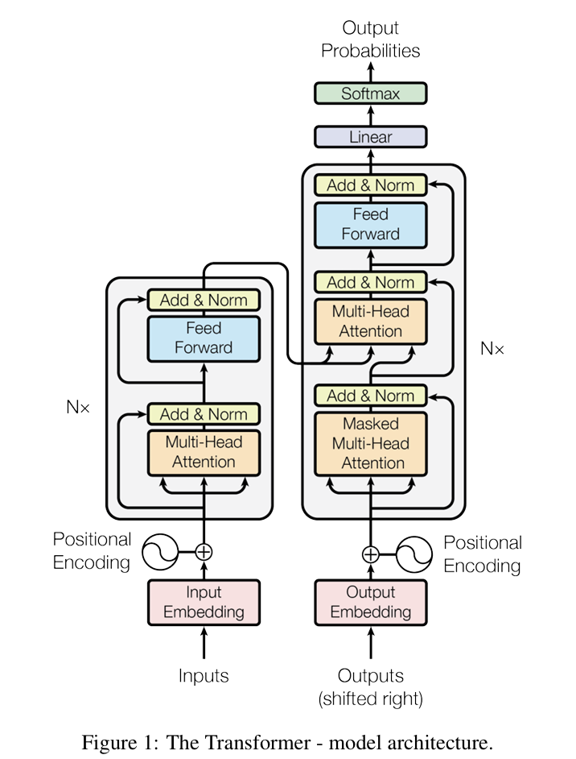

# 前言---Transformer与LLM的概念解释与理解

*本文主要介绍当下大模型中一些常见的术语和结构。旨在快速帮助那些已经对CNN、RNN有了解，但对Transformer及大语言模型领域不熟悉的人快速了解一些Transformer领域的行业术语和概念。*

## 一、Transformer架构与CNN、RNN

随着大语言模型的兴起，让人们深刻认识到了Transformer架构的巨大潜力。虽然这一架构起源于自然语言处理NLP领域，但因其简洁的结构和多模态融合的能力，如今已经可以在各个领域看到它的身影。很多人都说Transformer是CNN与RNN架构的终结者，并且原始论文的名称也彰显了作者的自信：“Attention Is All You Need.”事实上，我理解这句话并不是作者单纯想突出提出模型的优越性而拉踩其他架构。而是作者提出这个架构的核心思想就是，使用一个统一的架构来进行深度学习。

- 那么从深度学习的角度看，Transformer与CNN、RNN有什么关系呢？

要想真正理解Transformer与CNN和RNN的关系，就必须先搞清楚什么是深度学习，维基百科中给出定义：深度学习（英语：deep learning）是机器学习的分支，是一种以人工神经网络为架构，对资料进行**表征学习**的算法。深度学习中的形容词“深度”是指在网络中使用 **多层**。 

可以看到，在深度学习领域，无论是CNN、还是RNN，最本质可以拆解为两个过程：**寻找数据表征的关联进行学习**并且**通过非线性激活对网络进行加深**。他们都是从多层感知机（全连接,即对数据表征的所有维度之间进行全部关联）网络发展过来的。只不过在实际的机器学习过程中，由于**数据表征类型**类型的不同，而导致需要使用不同结构对表征数据进行相互关联、连接，而不是对所有数据进行全关联。

例如：在图像领域，最初始的手写数字识别BP神经网络，用的就是最简单的关联方式：全连接，即每个像素都和整幅图片的其他所有像素点进行关联学习。但是后来人们发现，对图像这种类型的表征数据而言，每个像素点并不需要对其他所有像素点进行关联，只需要找到该像素点与周围像素的关系即可。因为图像中的各种特征（例如物体边缘）都具有局部的特点。所以卷积神经网络CNN被设计应用，其本质就是定义一个窗口核K，使得每个像素点仅对其周围窗口K内的像素进行关联学习，再不断通过非线性激活来重复叠加网络，进行加深。

而对于语音、文本这类数据的表征而言，人们发现其有着显著的时序特征，即样本的前后时序特征是学习的关键，而并非图像这样的空间局部性特征。所以人们设计了RNN来学习样本前后的时序关联特征，可以大致理解为，网络每次的输入依赖于上一次网络的输出的全连接网络。即，在上一时刻网络输出的结果会影响着下一时刻网络的运行结果的神经网络。但可以看到，其本质还是多层感知机（全连接神经网络）。

在真正理解CNN与RNN本质都是基于全连接神经网络而进行的结构上的修改之后，你自然就会想到，如果Transformer也属于深度学习的话，其本质也应该是“类全连接网络”。是的，不同类型的网络区别仅在于怎样设计寻找数据的表征关系，找到关系之后，要做的都是通非线性连接的激活来加深网络层数。

那么Transformer是怎样寻找数据之间的关系的呢？没错，那就是注意力机制，这也是为什么架构提出者起的论文名称：Attention Is All You Need. 该架构是在NLP自然语言处理的背景下提出，作者认为，样本序列之间可以通过注意力机制来进行相互的关联，无论是样本在时间上的前后时序、还是空间上距离远近，都可以只是用注意力机制进行关联学习。在序列能够“注意”到与之相关的其他序列信息后，通过全连接来加深网络，进行深度学习。真正明白这点后，你就能理解为什么这篇论文的名字”Attention is All You Need“：无论什么样特征的样本，具有什么样的关联特点，都可以用这一个统一的架构进行关联学习。这也是现如今多模态机器学习能够融合不同模态样本进行理解、生成的最本质。

我们可以从下图中看到，Transformer的原始架构真的就是这么简单，只是Attention与Feed Forward模块的堆叠。注意：这里的Feed Forward就是多层感知机/全连接层（只是作者起了个高大上的名字）当然，图中还有很多细节，例如Embedding、Self-Attention、Multi-Attention....，将会在后续章节中详细介绍。

再通俗一点讲，你可以理解为Transformer就是由原原本本的全连接神经网络，每一个样本都会对其余样本进行全连接，只不过在进行全连接之前，使用了Attention模块根据注意力机制的得分对全连接网络中的权重参数W进行了调整。即注意到有关联的，保留其后续全连接时的权重，让其能够参与关联。而注意到没有关系的样本，之间将其全连接时的权重至0或者变小，让其在全连接时不能正常被关联学习到。

回想一下：在学习卷积网络CNN时，我们也被告知：CNN本质也可以看作全连接神经网络，只不过“全连接”的范围被限定在来卷积窗口核K的内部，即每次只对图像中的一个像素点及其周围的像素进行全连接学习。所以从数学公式上将，CNN就是一个全连接神经网络，只不过每次全连接时，对当前像素窗口K以外的像素的乘积系数W是0而已。

在这样的视角下，你就能理解为什么说任意的CNN网络都可以用Transformer来替代：如果Attention模块每次注意完毕之后，做出的判断都说修改全连接的权重参数，将当前样本的窗口K之外的样本都视为无关样本，即权重W置0。那么就等价于每次只在卷积窗口核K内进行全连接，与CNN没有任何区别。

只不过是CNN在计算时，对卷积窗口K以外的样本的操作是直接跳过，不进行计算。而Transformer做的是即使权重W很小或者已经等于0了，也要进行计算。所以在Transformer刚提出时，人们认为这样简化模型架构的代价是增大了计算量，并且认为很多额外的计算没有意义，所以当时在 CV图像领域并没有人看好，该架构。

最后，Transformer还有很多细节：例如通过位置嵌入矩阵Positional Embedding来让模型学习到样本的前后时序等。暂时不在这里进行过多的讨论了。

## LLM与Transformer的关系

再通俗一点讲，你可以理解为Transformer就是由原原本本的全连接神经网络，每一个样本都会对其余样本进行全连接，只不过在进行全连接之前，使用了Attention模块根据注意力机制的得分对全连接网络中的权重参数W进行了调整。即注意到有关联的，保留其后续全连接时的权重，让其能够参与关联。而注意到没有关系的样本，之间将其全连接时的权重至0或者变小，让其在全连接时不能正常被关联学习到。

回想一下：在学习卷积网络CNN时，我们也被告知：CNN本质也可以看作全连接神经网络，只不过“全连接”的范围被限定在来卷积窗口核K的内部，即每次只对图像中的一个像素点及其周围的像素进行全连接学习。所以从数学公式上将，CNN就是一个全连接神经网络，只不过每次全连接时，对当前像素窗口K以外的像素的乘积系数W是0而已。
在这样的视角下，你就能理解为什么说任意的CNN网络都可以用Transformer来替代：如果Attention模块每次注意完毕之后，做出的判断都说修改全连接的权重参数，将当前样本的窗口K之外的样本都视为无关样本，即权重W置0。那么就等价于每次只在卷积窗口核K内进行全连接，与CNN没有任何区别。

只不过是CNN在计算时，对卷积窗口K以外的样本的操作是直接跳过，不进行计算。而Transformer做的是即使权重W很小或者已经等于0了，也要进行计算。所以在Transformer刚提出时，人们认为这样简化模型架构的代价是增大了计算量，并且认为很多额外的计算没有意义，所以当时在 CV图像领域并没有人看好，该架构。

最后，Transformer还有很多细节：例如通过位置嵌入矩阵Positional Embedding来让模型学习到样本的前后时序等。暂时不在这里进行过多的讨论了。

## Transformer的两个组件

- 编码器encoder   
还是以中文翻译英文举例，在进行编码器编码时，我们的输入是整个的中文句子。该阶段的目标是要理解每个字在整个上下文中的含义，所以我们需要将当前输入的词对整个上下文进行Attention注意关联，进行深度学习。最后输出每个词具有上下文关联的真正含义。   
但这样有个坏处，就是你学到的只是这个词的真正含义，但没有学到推理过程，即怎样推理这个词出现后，下一个词应该是什么？

- 解码器decoder   
解码器便是专门负责推理这一过程，该模块的输入只能是一个单词，而不是编码器那样可以输入多个词组成的序列。输出便是推测在这个单词词出现时，下一个应该出现什么单词词。在预测出下一个词后，把预测的词再次当作输入，进行第二个词的预测，如此往复，就能输出一个完整的英语句子。注意，编码器输入并理解的是中文，但是编码器的输出与输入都应该是英文。   
而单独的解码器是没有中文的上下文信息的，所以在解码器模块中，我们可以看到，每次输入的Token在推理预测的过程中，需要对编码器中理解的“上下文”信息进行交叉Attention注意，从而使得在英语单词预测时，能够获得正确的中文语义中的上下文含义。

### 回到对话模型场景   
现在的大语言模型LLM，是基于对问题进行预测回答的这样的学习过程，而非机器翻译seq2seq这样的序列到序列进行转换的学习过程。而在理解了编码器encode和解码器decode之后，你知道了：编码器只有上下文理解能力。而对于解码器来说，虽然其主要负责推理，但并不意味着其没有上下文理解能力。即解码器同时具有着理解上下文的能力和推理能力。   
在理解上下文的能力上与编码器相比，唯一不同的便是解码器不能看到完整的句子，必须根据当前输入的词以及已经出现在该词之前的句子，进行上下文理解，然后预测下一个词。
所以一个很自然的想法就是，那么在问答对话的应用场景下：给出一个问题，根据当前的问题预测下一个词，似乎只使用解码器decode就可以完成任务了。事实也确实如此，现在流行的大部分大语言模型，都是使用**Decode-Only，也就是只有解码器的Transformer架构**。

> Click here to jump the :[Next Chapter](./Transformer_1.md)