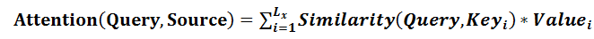
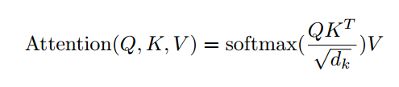

# 理解Attention---从人类思考过程理解Attention

*在上一篇文章中，我们详细解释了Transformer与CNN、RNN还有现在的大语言模型LLM的联系与区别。在了解到Transformer到底为何物之后，便会发现Attention机制是Transformer架构的核心。本文将会通过剖析人类在面对一个提示场景下，如何利用注意力快速检索信息，来推导出当下最经典的Attention注意力范式。*

---

## 一、Attention 机制

在首先我们需要明确一个点，那就是Attention注意力机制并不是只有NLP领域的Q、K、V进行关联的这一种形式。在CV图像领域或者其他任何领域都可能有不同的实现方式。

Attention这一想法最核心的点是：对我们的样本特征进行重要程度的评价，评价的依据是是否与我们关注的事物或者事件相关，越相关则认为越重要。如何才能量化“重要”的这个程度呢？那就是通过加权乘积的方式来对样本特征进行处理，越重要的样本权重越大，越不重要的样本权重越接近0。

上面的思想非常通俗易懂，即我们想要在样本的表征学习中，更加关注我们想要的数据，稀释我们不想关注的数据。那么如何将这个过程量化成数学表达呢？因为如果我们想要将一个idea在计算机中实际应用起来的话，必须要有一个清晰的 **数学表达** 过程，如果只是笼统想法，那么根本无法在计算机中实现。

接下来我们尝试在一个具体的例子上分析我们人类自身是如何使用注意力机制进行观察事物，并从工程数据分析的视角将**整个过程抽象为数学表达过程。**

首先我们假设拥有一组样本记为符号V。那么想要确定一个样本重要与否的大前提是要确定我们感兴趣的事物/事件。因为同样一个事物，例如一张篮球图片，其引起的关注程度对于足球粉丝和篮球粉丝显然是不同的。那么现在我们假设我们想要关注的事物/事件为Q。此时你要做的是在Q这个提示下，告诉我V样本中，哪些样本重要（你感兴趣），哪些不重要（不感兴趣）

接下来让我们举一个实际的例子来进行推进：例如我们有一张图像V。现在我告诉你，你需要看完图片后，告诉我图片中出现了几个篮球？那么在这样的场景下，显然Q就是“篮球”这个词语。

接下来你在看图片时一个很自然的过程是：你将会快速扫过画面，并逐个锁定图片中圆形的物体，因为你知道篮球肯定是圆的。然后逐个分析，其到底是篮球？还是足球？还是一个钟表？ 

在这一个过程中，我们的大脑展现了惊人的多模态的理解与抽象还有高效的注意力机制：即我们能通过文字“篮球”获得提示，并且快速想象出“篮球”的图片，然后紧接着进行高维抽象：即篮球都是圆的，那么图像中所有“直线”类型的边界像素都可以被我快速忽略。所有具有“圆形/弧线”特征的像素点都会被你重点关注。

回到注意力机制的正题，我们仔细思考这一过程后就会发现：首先我们将文字模态的“篮球”Q转换为了图像模态的形状：“圆形”。但这时我们仍然无法进行关联，因为说到底，V是以像素点组成的图像，我们怎样才能和判断一个像素点V’和“圆形”Q的相关程度？很自然地，你会想到设计一个方法K,他能够对每个像素点V’的周围像素进行分类判断，并输出一个数值。具体计算的过程就是判断该像素点周围一圈的像素，如果是弧线，那么K输出的值越高，如果包含直线多，则K的值就越接近0。

那么，我们使用K方法，遍历整个图像，就会生成一个和原始图像V一模一样大小的矩阵，记为A。而这里的这个A其实就是注意力得分（Attention Score）矩阵。我们最后只需要将注意力得分矩阵A点乘原始的样本数据V矩阵，就能得到一个全新的，经过注意力机制浓缩、稀释的样本V_new。

以上便是注意力机制的核心思想的推演。理解后，将上一个过程进行数学上的抽象总结，就有了这个最经典的公式：

只是需要注意的是，这里的Similarity并不是必须是向量Q与K的乘积，Q与K也不一定是一组向量，他可能是一个事件、一个方法。但无论如何，你只需要记住，Q是你感兴趣的方向,K是将样本V变换至能够和Q直接进行相似比较的一个集合。所以K与V总是一一对应的，K就像我们感兴趣的方向Q与数据样本V之间的桥梁。

## 二、NLP领域中的SelfAttention自注意力机制

只是在NLP领域，我们将Q、K、V都当作词向量。即每个词都是高维语义空间中的一个向量，那么两个词的含义越接近，那么这两个词的向量也应该越接近。例如“你好”和“Hello”如果共处同一个语义空间的话，这两个词所对应的向量应该非常的接近。想要更深入了解高维词向量空间，可以去看b站3b1b的视频讲解：关于Transformer的解释

从而，我们就将Similarity过程转换为了计算向量是否接近。如果你理解线性代数，就会自然的想到，判断两个向量是否接近，可以通过向量点积的值来进行衡量。因为两个向量的点积等于两个向量的模的乘积再乘以向量夹角a。最不相关的两个向量应该就是互相垂直的情况。

至此，就又理解了另外一个很经典的公式：

对于任意一个我感兴趣的词向量Q,我可以通过对上下文中的所有词向量（记为K）进行点积，得到注意力机制得分矩阵，然后通过softmax得到具有概率含义的句子，最后对原本的上下文词向量（记为V）进行加权、相加，得到最终的注意力结果。（这里除以根号dk是在工程上的优化手段，可以忽视）
这是你会发现，为什么K和V都是上下文词向量集合？那是不是意味着K和V就是同一个东西？是的，别忘了我们之前所说的，K只是Q与V之间沟通的一个桥梁，但如果Q与V同处于一个模态，可以直接进行相关比较。那么我们何须再设计一个K？我们当然可以把K看作V的恒等映射集合。
再进一步，你会发现，当我想要关注的词向量Q，变成正片文章。即我想分别计算正片文章中，每个字的上下文关系，那么Q变成了什么？没错，又是所有的上下文词向量集合。突然你会发现，这不就是自注意力机制吗？没错，这就是NLP领域常常使用的SelfAttention。即将我们的文本序列同时当作Q、K、V进行上下文信息注意。是一个非常自然的想法。

> Click here to jump the :[Next Chapter](./Transformer_2.md)