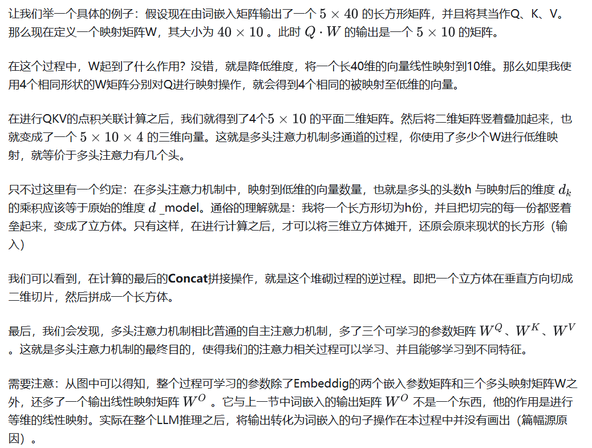

# 图解LLM推理完整流程---Attention算子

> Written  In 2024_11.16 ___by yxl   
> Last Edited In 2024_12.26___by yxl

在之前的文章中，我们已经了解了Transformer的基本架构和Attention的机制思想：

而本文的目的是为了探究LLM在推理过程中Attention算子的真实细节。事实上由于现在网上大部分人们在介绍LLM的Attention或者LLM时，都会或多或少简化其中的计算过程。并且在描述流程时，对模型的参数名称进行了各式各样的修改。这就导致在我们想要尝试自己计算一个LLM模型大小参数、或者一次前向推理需要多少次计算操作时，会发现根本无从下手。

故本文将会通过具体的矩阵计算过程图来探究在Attention机制究竟是如何在大语言模型LLM的推理过程中发挥作用的。

---

在现在大部分LLM当中，多采用Multi-SelfAttention多头的注意力机制。但如果在不清楚Attention计算流程的情况下直接了解多头注意力会感觉较为复杂。所以本文将先介绍单头的SelfAttention的计算过程。（注意！Self-Attention的计算过程只对理解Attention机制有帮助，其实际的参数和计算过程与多头注意力机制有较大的出入）

## Self-Attention

*注意：Self-Attention的流程图主要用于理解Attention计算过程。更严格地说，只表达了LLM中Perfill的过程，而Decode的流程将会在后续给出。*

下面进行一些变量名称解释与约定：
1. 流程图中矩阵块的长和宽严格遵守了矩阵乘法的规则
2. 名称为黄色的都是参数矩阵，名称为紫色的是输入流动的数据。
3. S 为输入文本的序列长度，例如输入：“同学们大家好”，那么S应该为 6。
4. V为预训练时词汇表的长度，通常大小为250,000左右。
5. d_model： 模型隐变量维度，是衡量模型参数大小的重要指标。也是词嵌入层的输出维度。
6. Matmul：矩阵乘操作。
7. Scale ： 缩放操作，就是原公式中那个除以 根号dk 的操作

可以看到，如果仅仅是单头的自注意力机制，那么在整个Attention过程中，计算参数只有词嵌入矩阵和词嵌入位置矩阵。（输出矩阵Wo与词嵌入矩阵共享参数，即转置关系）。

我们会发现整个注意力相关的计算过程没有什么可以学的参数。所以作者借鉴了CNN网络计算过程中“多通道”的思想：即对一个单通道的样本拓展至多通道数，来增加学习到特征的多样性。从而就有了多头注意力机制。

接下来让我们一起看一看多头注意力机制的计算过程：

## Multi-SelfAttention

下面的计算计算过程是严格按照Transformer论文中数据的计算格式和名称进行绘制的。在后续计算LLM的推理计算量和模型参数时，可直接使用该图作为参照标准。

注意：变量h为多头注意力机制的头数。并且在改图中h应该为2，虽然图中画了3层，那只是为了说明该矩阵是一个三维矩阵，并不代表其高h为3。并且作者规定：d_model = d_k * h，后续会讲解为什么）

我们可以看到，整个流程被分为了几块：Vocabulary Embedding词嵌入层、Linear线性映射层、Scale-Dot-Product Attention 缩放点乘注意力层。

其中Scale-Dot-Product Attention层的计算过程与之前的SelfAttention中的计算过程完全对等，只不过将原本的二维的Q、K、V向量矩阵变成了三维张量Tensor。但是在具体计算过程中，还是每个二维的向量切片做计算，最后叠加至三维。

此过程与SelfAttention最大区别是，多了一个Linear线性映射层。那么怎样通俗的理解这一层在做什么呢？

## Pre-filling and Decoding Stage

到了这里，我们知道了在LLM中attention算子的基本计算流程。但是在实际应用过程中，我们知道，LLM中的attention是基于Transformer中的decode解码部件设计的。那么到底什么是decode，或者说，decode和encode的最大区别是什么？

答案是Mask屏蔽操作，即在decode流程中，Q矩阵中的元素只和标号小于或等于起自身的K、V进行attention操作。也就是假设输入了10个Token，相应会产生10对Q、K、V。那么第五个Token产生的Q，只会与前五个K、V进行attention，而不会和后续的K、V发生计算。

也正是因为这样的特性，使得LLM在推理过程中，分为了两个阶段：Pre-filling 和 Decoding。让我们通过具体的例子来说明这两个过程：

假设你对GPT输入句子：“你好，你是谁？”。那么首先，GPT需要一次性这句话的7个Token并行一次性输入模型，进行计算，这个阶段就叫做**Pre-filling预填充**。这个过程也是我们之前在理解Multi-Attention的图解所描述的过程。

而在并行处理完用户输入的所有提示词prompt之后，便开始生成第一个预测的Token，然后将生成的Token重新与之前所有的Token进行Attention，从而生成下一个Token，不断往复。这一个过程，也就叫做**Decoding解码过程**。

## KV Cache

我们现在知道了LLM在推理过程中，有两个阶段。Pre-filling阶段的流程就是我们之前介绍Multi-Attention时所描述的流程。那么Decoding阶段的计算流程是怎么样的呢？他与Pre-filling阶段一样吗？

在你真正理解decoding阶段计算的流程后就会发现，每次新生成的Token，经过Q、K、V权重矩阵生成自己的Q_i、K_i、V_i之后，当前Token的Q_i向量需要与之前生成的所有Token的K、V进行attention计算。

而这里，由于我们的LLM是Decode-only类型的Transformer（这里说的是Transformer的两个组件Encode、Decode，与上文中的decoding阶段不是一回事）。所以无论新生成的Token内容是什么，实质上不会改变之前所有生成的K、V。所以说，我们在每次计算完毕之后，完全可以将计算出的所有K和V进行保存，等下一次Token生成新的K_i和V_i向量后，将新的K_i、V_i与之前保存的K、V进行拼接，生成本次计算所需要的完整K、V，如下图所示。这个过程就叫做**KV Cache**。

在这个流程中的K和V矩阵块中，橘色的块表示之前阶段生成的K、V。蓝色表示当前Token所生成的Q、K、V。

## Group Query Attention

上述KV Cache技术实际上是一种用空间换时间的策略。在模型与上下文较小时，这样的策略会极大提升推理速度。但是随着模型变大与上下文长度的不断增加，KV Cache所缓存的内容也就越来越多，从而造成内存瓶颈。

所以在Modern LLM中（ps：'Modern'一次出自llama3的论文原文，再一次感叹大模型时代发展的日新月异，两年的时间就已经开始用classical、Mordern来形容不同的技术了），特别是针对上百亿、千亿参数的LLM，往往会采用Group Query Attention技术来压缩我们的K、V，从而缓解KV cache带来的Memory Bound。

要想理解Group Query Attention，我们需要再重新看看Multi-Attention中的细节：

我们可以看到，所谓的Multi-Attention,实际上就是将原始的只有一个通道channel（也可以理解为一个二维矩阵）的Token，在进行Q、K、V转换计算时，映射为多个通道channle（多维张量tensor）。

**但是，从原始的One Head 映射到 Multi Head多头之后，其Q、K、V的数据量在映射前后必须是不变的！**

用上图的流程进行举例：假设输入的token数量S=3，模型d_model=12，也就是原本有一个3x12的输入Token矩阵。如果要使用4个头的Multi-Attention。那么就需要将这个3*12的矩阵映射为4个小矩阵，而每个小矩阵的现状必须为：Sx（d_modle/num_head）= 3 x (12 /4) = 3x3的矩阵。

所以说,Multi-Attention是在遵循Q、K、V数据量不变的前提下，将其映射到多个通道，来寻求模型能够学到不同特征的attention。

而Group Attention的思想是：**在进行Multi-Head多头映射时，保留Q矩阵映射前后矩阵数据量不变的特性，但是对K和V进行分组缩放。** 如下图所示：

沿用前面的4个Head头的注意力机制流程，此时如果使用Group Attention，并且分组数为2时（也就是每两个分一组）。这样一来，针对4个Head的Q矩阵，原本需要4对K、V，但是我们人为将两个K、V分为一组，并且每组的K、V为相同的值。

而之前介绍KV Cache时我们知道，Q矩阵在计算完成之后就被扔掉了。只有K、V会保存下来供后续计算使用。那么在Group_num=2时，我们的KV Cache缓存需求就直接被压缩减少了一半。

但是这样的压缩并不是免费的，肯定会对模型性能造成一定的影响。但是对于一些超大的上千亿参数的llm来说，进行适当的分组后，可以带来很好的KV压缩，并且只会略微影响模型性能。

---

以上便是LLM在推理过程中，关于Attention算子的全部介绍。在后续章节中，将会以LLama模型为例子，介绍llm的完整推理流程和一些模型参数的量化分析

> Click here to jump the :  [Next Chapter](Transformer_3.md)