# How GPU Computing Works

> Written  In 2024_12.18 __by yxl   
> Last Edited In 2024_12.26__by yxl

*在谈论到性能分析和优化方法时，常常会听到“内存瓶颈”、“访存瓶颈”、“计算瓶颈”等词汇。这些词汇在我们的脑海中一闪而过，但很可能我们并没有理解他们的本质。Nvidia GPU架构师Stephen Jone在21年的一次公开演讲中阐述了GPU的本质，并且揭示了到底何为“计算加速”这时一次非常经典且深刻的演讲。所以本文将会对这次的公开演讲进行翻译和基于自己理解的阐述。*

（！本文为翻译解释型总结，文档中的PPT演示图片均来自于原演讲视频：[Nvidia_GTC_21-s31151](https://www.nvidia.com/en-us/on-demand/session/gtcspring21-s31151/)

## Why GPU Computing Works?

首先，要想知道GPU是如何工作的之前，你需要要知道为什么GPU这样的架构相对于CPU来说，是可行的？我们知道，通常我们将GPU视为计算加速的设备。这句话中有一个隐藏点：即所谓加速，指的是相对于CPU来说的计算加速。

那么想要知道GPU如何相对于CPU加速前，你需要弄清楚到底什么是计算？原作者在这里直接给出了结论：在谈论到计算时，对于绝大部分情况，你真正需要考虑的可能仅仅是："**Where's my data？**"即我的数据在哪里。

接下来我们将详细解释，为什么计算加速优化的本质是“Where's my data？”问题。

## 二、Nobody Care About Flops

这是一个非常反直觉的结论，因为现在我们在谈论一个机器的计算性能时，总会提及它能达到多少多少G/T Flops。但事实上，如果你深入分析你的程序时，对于绝大部分情况而言，core的Flops的多少根本不重要。其实这就是所谓的瓶颈问题，即大部分情况，我们面临的都是数据带来的内存瓶颈，而非计算瓶颈。（当然也有例外，将会在后面介绍）

接下来我们将以CPU的数据进行解释，为什么会这样。首先我们需要了解一些相关概念：

### Compute Intensity（计算强度）

*（这个概念非常重要，后面会多次提及）*

我们先来看看如何计算一个设备的 Compute Intensity：

如果一个CPU的浮点计算性能为：**2000GFLOPs**，DRAM的传输速度为200GBytes/sec。并且通常我们谈论CPU的浮点计算水平时，默认数据类型为FP64位，所以**Data Rate**= 200/8 = **25 Giga·FP64**

那么 **Compute Intensity = FLOPs/(Data Rate) = 80** 。

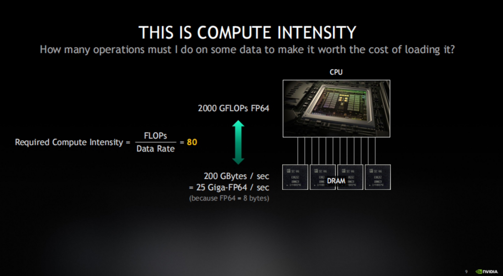

这里的 80代表了，一个处理器每秒钟可以计算的数据量是其DDR内存传的输数据的80倍。也就是说，我需要对同一个数据重复80次操作，才能把我的CPU的计算能力用光！要牢记，Compute Intensity并不是单纯代指设备的计算强度，而是与其数据传输速度有关的一个统计量。其含义为：在当前设备系统下，若要让处理器一直处于忙碌状态，则需要对数据进行重复操作op的数量）

用生活中的例子来说，假设你买了i9处理器，那么其Compute Intensity大概率为80左右。那么你运行的一切程序，只要对同样的数据没有重复使用超过80次时（绝大部分程序都达不到这个要求），那么其性能表现很肯与其他人的i5处理器没什么区别。当然，以上的情况是假设没有任何cache缓存和其他优化手段的情况下的结论，只是为了概念介绍。

接下来展示了当今芯片设计三巨头：Intel、AMD、Nvidia旗下产品的 Compute Intensity 对比：

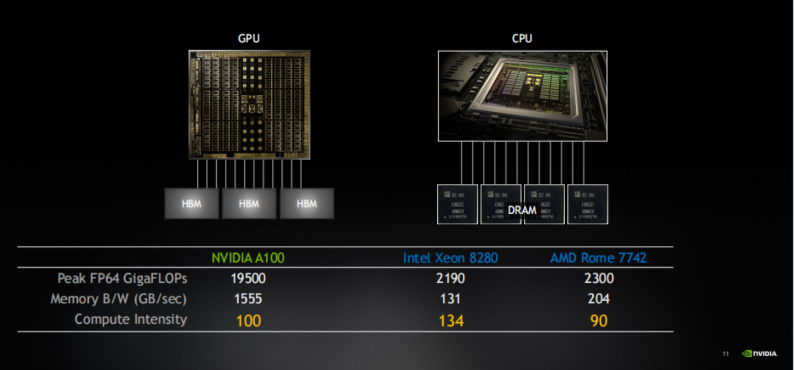

我们可以看到，无论是Nvidia的GPU还是红蓝厂的CPU，其Compute Intensity都在100这个数量级左右。而这是一个不好的数字，因为Compute Intensity越高，代表在大部分场景下，我们的算力被浪费的越严重。

这也是原作者为什么说：“Nobody Care About Flops”。即我们现在的机器已经拥有足够多的Flops了，如果不能让CPU忙起来。那么设计的CPU性能再好也没有意义，即CPU空转的情况只会越来越严重。这其实就是所谓的**内存带宽瓶颈、 Memory bound**。

### Latency 数据延迟

但上面的讨论是在理论层面进行的宏观的分析(即假设我们的内存带宽可以跑满的情况下)。而实际的应用场景下，将目光聚集到指令级别的层面上时，你会发现我们可能更应该关心的是数据传输的延迟Latency。接下来我们以一个具体的例子来理解它：

这时一个非常简单的乘加操作循环，并且基于这样范式的操作在数学领域应用非常广泛，以至于现代处理器的指令集中专门设计了该类型操作的指令：FMA(乘加运算)，是的你可以使用一个指令来完成这个操作。

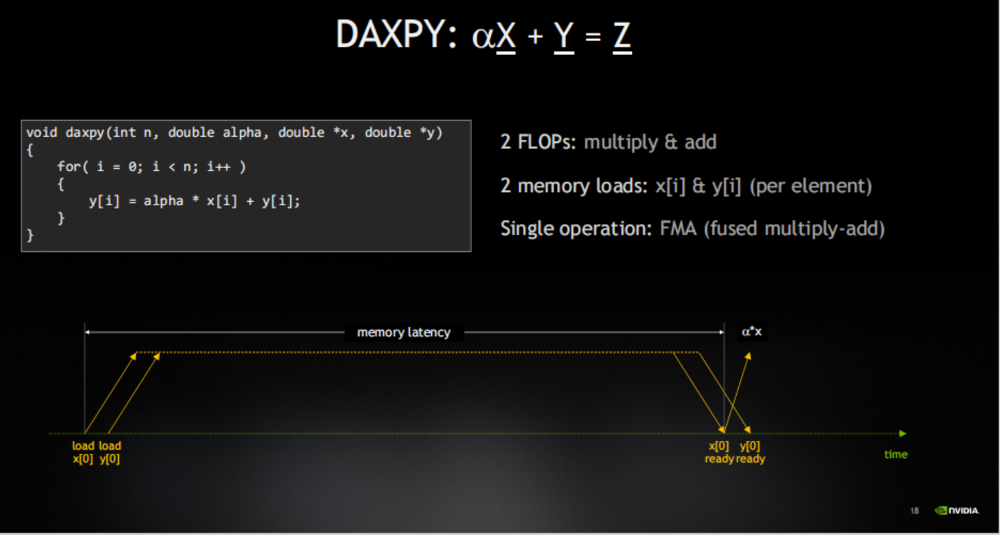

接下来，让我们看一看进行一次这样的计算操作，在时序细节上需要经历什么：我们可以看到，在处理器发出对x和y进行load的指令之后，处理器就陷入了漫长的等待，非常非常长的漫长等待。图上的menmory latency占比是经过缩放的，因为如果按照实际的时间占比，将menmory latency拉长后，整张图片将会看不清处细节。

而每次计算需要进行如此漫长的等待意味着什么？让我们用一个数据来说明：

假设你的预算非常充足，选择了intel至强系列Xeon 8280（顶级服务器CPU）。并且斥巨资购买了昂贵的DDR内存，其拥有131 GB/sec 的带宽和89 ns的数据延迟。呢么相应地算出，你可以在每89ns里传输11,659 bytes的数据。

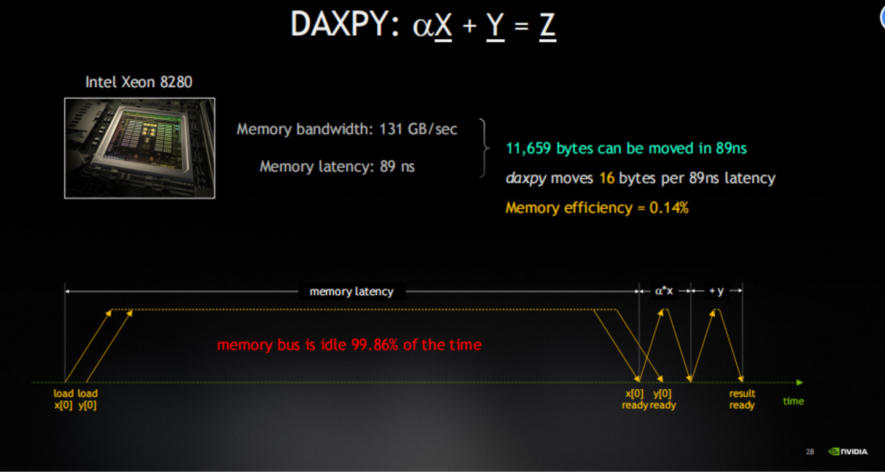

只可惜，你在这段时间内只load了两个8 byte的数据（x和y）。所以说你的内存总线在89ns里只传输了16bytes的数据。即你的内存利用率Memory efficiency只有0.14%。也就是说在这个计算过程中，你的内存总线空闲率为99.86%！！

这也是为什么在之前我们讨论到计算的瓶颈是内存带宽Memory bandwidth时，你实际上应该更关心Latency。这时因为在大多数计算场景下，由于数据时延的问题。你的Memory bandwidth根本就跑不满。

更具体地，同样让我们看看芯片三巨头的产品，在DAXPY(aX+Y=Z)的测试场景下，表现如何：

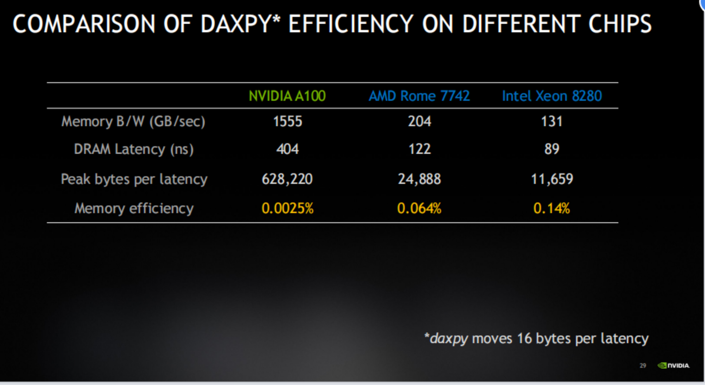

结果非常的Amazing，intel的Xeon 8280的表现竟然还是最好的(虽然只有0.14%)。

所以读到这里，你就能真正理解最开始那句话：“Nobody Care About Flops”。即因为我们的内存带宽Memory bandwidth的限制，使得我们的处理器常常处于闲置状态(体现为Compute Intensity倍率)。而在实际具体的计算场景的限制下（体现为Latency），我们可能连内存带宽Memory bandwidth都用不满！更别说Flops了！

## 三、解决Latency问题

前面说到，对于实际的问题而言，Latency是我们首先需要关心的。也就是内存利用率Memory efficiency过低的问题。

那么继续使用之前的数据，对于Xeon 8280的例子而言，其内存利用率为0.14%：即每秒钟可以从内存中读取最多11659个字节，但是对于Daxpy这样类型的场景来说，却只load了16字节的数据。

那么如果要在这样低内存利用率的场景下还想让内存总线跑满的话，需要一次性执行729次这样的计算。

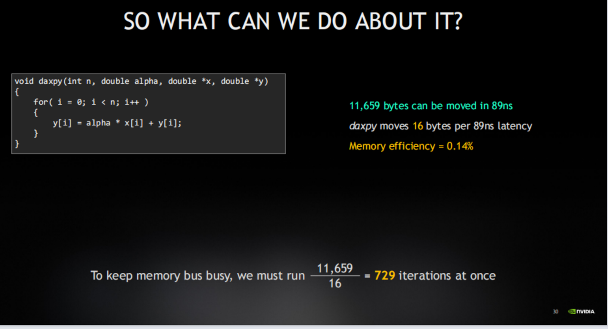

那么在现代的计算机体系架构中，如何做到这件事呢？(一次性执行729次这样的计算)

首先应该想到的是：**并发concurrency**，并发是指一些相互独立互不影响的负载任务可以被**交错执行**而不影响最终的结果。

对于现代编译器而言，其可以自动识别代码中相互相互独立的代码结构，并将这样的for循环unrolling展开为back to back的形式(即展开后的语句之间没有逻辑分支控制，只有运算操作等)如下图所示。

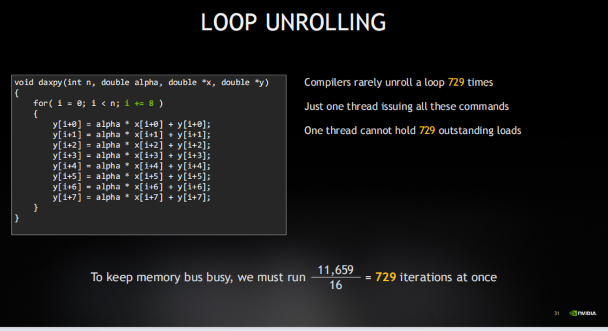

在得到这样的back to back的代码之后，CPU便可以利用**流水线展开pipeline**，从而实现并发：在执行第一行代码：load x[0]、y[0]并且等待内存总线响应时，不堵塞等待，而是继续执行后续代码（load x[1] y[1] ....），直到内存总线响应了第一行代码的读请求，再重新跳转回第一行代码进行计算处理。这样便可以在单个线程内实现指令上的并发，从而增加我们内存总线的使用率。

但是通过pipeline流水指令展开实现的并发并不是无上限的，其最大可以并发迭代的数量受到硬件限制。也就是我们所熟知的**流水线深度**，即硬件上能够trace的最大操作数量。

直到这里，我们仍然只使用了**单线程进行计算**，也就是说即使编译器可以将上面的代码进行loop unrolling展开，将代码变成729个back to back 形式的指令语句(虽然这样的情况在现实中不太常见)。但是由于硬件的限制，我们并不能将729个未加载的数据一次性读入，从而跑满带宽。

所以我们需要使用多个线程进行**并行 parallelism**：并行在概念上要强于并发，因为并行要求相互独立的语句需要**同时执行**，而并发并不需要真正的同时运行。

所以我们可以利用编译器将代码loop unrolling展开为back to back形式之后，分配到多个线程中，实现程序的并行运算，从而将我们的带宽跑满，以掩盖**内存传输延迟Latency**带来的效率上影响。
那么接下来让我们看看不同类型的处理器在这样的场景（daxpy运算）下，需要多少线程并行运算，才能抵消内存**延迟latency**带来的影响：

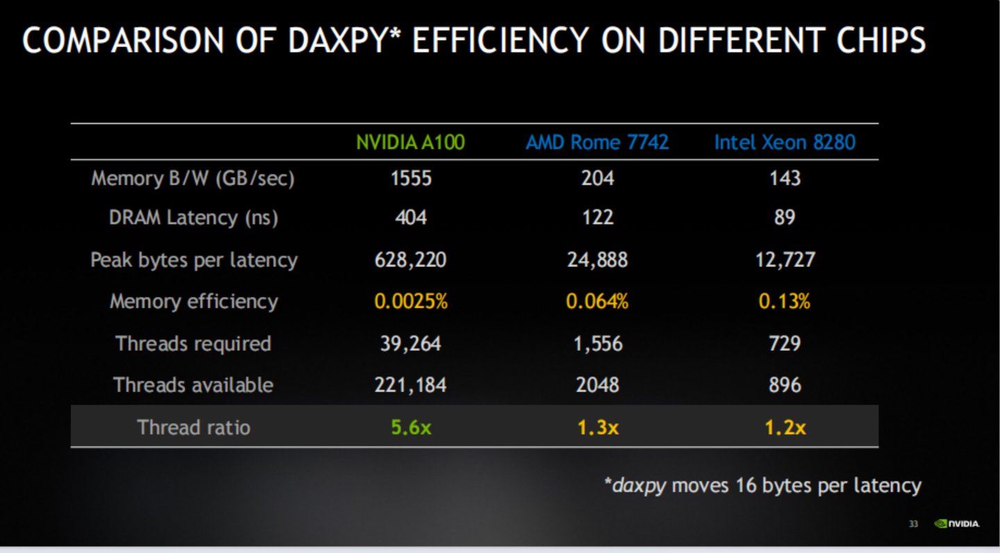

我们可以看到，GPU拥有着远超过CPU系统的内存带宽，和内存延迟。所以其需要比Xeon 8280多出**40倍左右**的线程数量才能抵消内存延迟带来的负面影响。

但是GPU所拥有的线程总数却比两种类型的CPU高出**100多倍**。所以在这样的工作场景下，GPU拥有的线程数量是其需要使用的线程数量的5.6倍。而CPU拥有的线程数量和其所需要的线程数量非常接近，为1倍多一点。

**这就是GPU和CPU在设计上最显著的区别**：在面对Latency所带来的计算瓶颈时GPU进行了designd for over subscription 超量的线程设计，即GPU所拥有的线程数量要远多于你**实际所能够运行**的线程数。

在GPU中，如果有线程在堵塞，等待内存响应时，永远有非常充足的其他线程等待被激活、运行去消耗带宽，从而抵消高额Latency带来的负面影响。这种设计叫做**throughput machine** ，为了高吞吐量场景所设计的机器。即GPU的设计者将所有精力和资源放在如何添加更多的线程数量来掩盖Latency带来的问题，而不是去减少Latency。

而对于CPU而言，它是一种为了优化延迟Latency的机器，**Latency Machine**。其在面对Latency问题时，并没有设计过多的线程来抵消负面影响，而是设计去减少Latency本身。即CPU需要尽可能地在一个线程里完成主要地工作：切换线程（context切换）是非常昂贵、耗时的。所以CPU的设计者将绝大部分精力花在了如何减少latency，而不是增加更多的线程。

做一个总结：CPU与GPU这两种类型的处理器，在面对Latency带来的负面影响时，选择了完全不同的应对方案：GPU设计者系统尽可能地直接减小Latency。

## 四、GPU Memory Hierarchy 内存层次

 通过前面的分析，我们了解了GPU与CPU设计理念上的差异。所以无论对于CPU还是GPU而言，解析其工作原理最核心的便是搞清楚where are my data ?所以接下来我们需要搞清楚GPU的内存层次结构是怎样的。

让我们通过分析下面的GPU内部的Memory Hierarchy内存层次图，来探究GPU的工作原理。

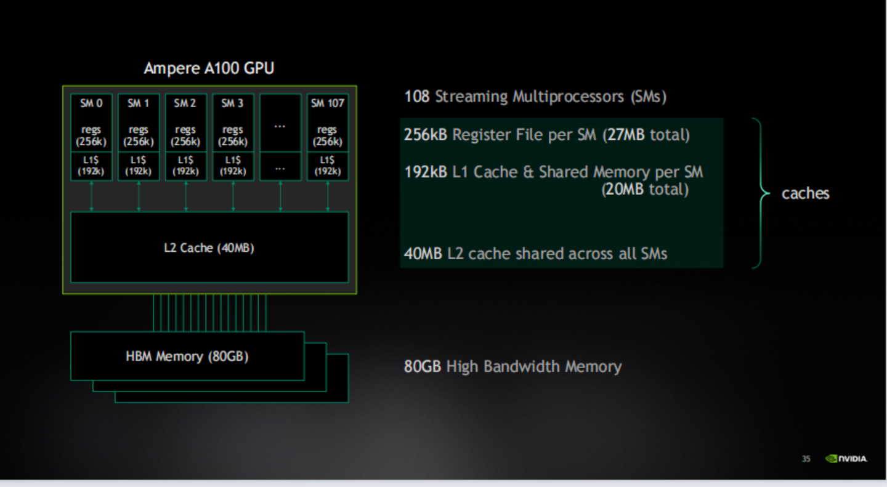

首先需要注意的是在GPU中，将HBM,High Bandwidth Memory视为Main Memory，也就是我们熟知的显存(对应着CPU中的DDR内存)。并且在GPU中，**Register寄存器被视为了caches的一部分！**即GPU在每个thread线程中使用了大量的Register(甚至比L1级cache的数量还要多)作为离计算单元最近的cache，来保证计算时较低的Latency。

这样设计是因为GPU的其他内存层次(L1、L2、HBM)等内存具有非常大的Latency(相对于CPU而言)。所以，对于GPU而言，**其Register的数量直接决定了GPU计算时能够直接操作的数据量的大小**。(ps题外话：被广泛应用的Flash Attention正是基于GPU的这个特性，进行优化的算子)。所以**巨量的Register(可视为L0级cache)是GPU计算最基本的保证。**

这样的内存结构与CPU完全不同，因为CPU的cache主要是作为buffer缓冲来使得所需要的数据尽可能地离计算core更近，并且通过复杂的策略来减少buffer的miss hit 未命中，来掩盖数据访问主存(DDR)的Latency。

接下来让我们看一看GPU中不同层次的内存的带宽B/W与Latency的情况：

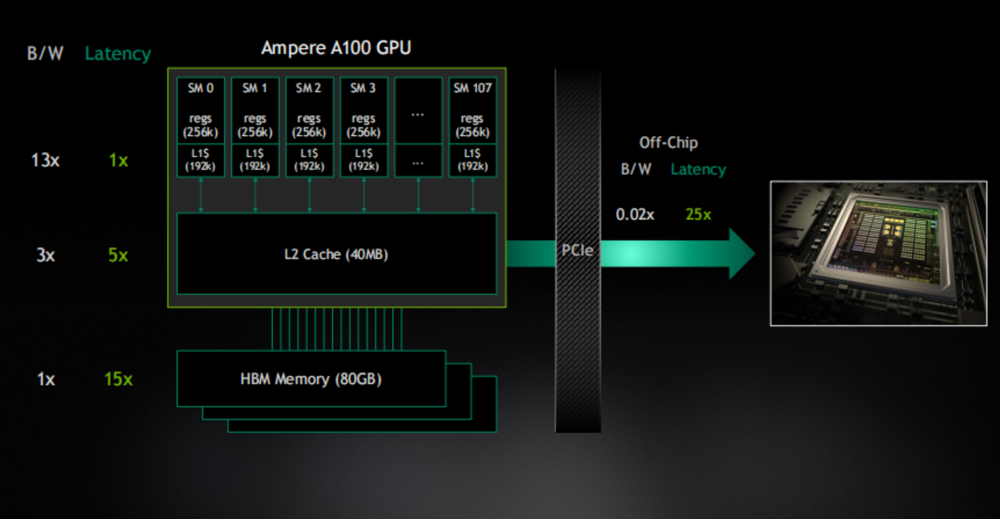

可以看到，如果将主存HMB的带宽作为基准1来说，L2 cache的带宽为3， L1 cache的带宽为13。以L1 cache的数据传输延迟Latency作为基准1来说的话， L2 cache的 Latency为5，HMB的latency为15。而至于片外的DDR内存（即通过PCI-e进行传输的数据），其带宽与延迟表现都远低于片内的内存结构。

所以我们可以看到，随着内存结构离计算core越近，其内存带宽就越大。这是非常好的特性，因为越大的带宽，意味着我们的**Computer Intensity**就越低如下图所示。（如果忘记了Computer Intensity的含义，可以回过头去看看最开始的讲解）。

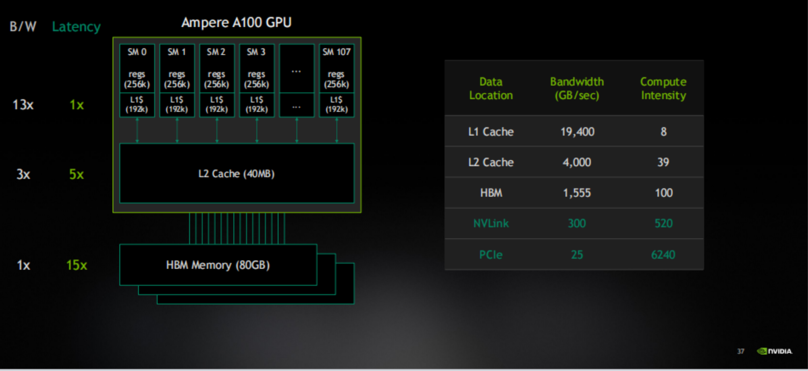

我们可以看到，距离计算最近的L1 cache的Computer Intensity仅有8，这是非常容易达到的(即每加载一个数据后，需要对该数据操作八次，才能使得GPU计算core一直处于忙碌状态)。而我们的PCle的Computer Intensity达到了惊人的6240，这意味着如果要从DDR中直接读取数据进行计算，几乎不可能使得GPU的计算core忙碌。

接下来让我们看一看，不同内存层次下的Latency表现，以及对于他们来说，分别需要多少thread才能掩盖Latency带来的负面影响：

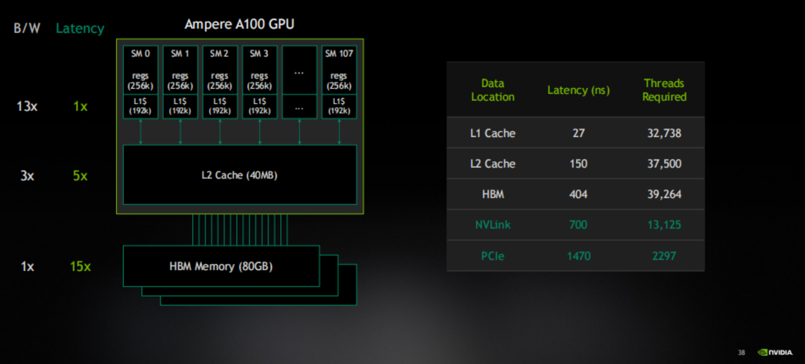

一个非常有趣的现象发送了：随着我的内存离计算core越近，其延迟Latency越低。但是其所需要的th read数量并没有减小。这是为什么？没错，这是因为虽然我们的Latency在逐层变低，但是相对于的带宽B/W却在逐层增加。

这正是GPU的设计者精心设计所维持的平衡trade off：即内存层次的Latency越低，其相对于的带宽B/W就需要按比例增大。显然这是非常合理的，因为一旦在内存层次中，有任何一个层次的内存破坏了这种平衡（比如增大了带宽B/W，却没有按照对应比例减小），就会导致该层次的内存需要更多thread来掩盖其Latency带来的负面影响。但是其他层次并不需要这么多thread。这就造成了一种浪费（or 瓶颈）。

## 五、GPU计算单元:SM,Streaming Multiprocessor

在了解了GPU的Memory Hierarchy内存结构之后，让我们来看一看其内部计算单元的细节：SM是GPU中的基本处理单元，在A100中，一共有108个SM(SM可以类比于CPU的核)。所以从这个层面就可以看到，通常的个人pc使用的CPU数量在10-30个核。而GPU中的处理核则要多一个数量级。

让我们回想一些，对于CPU来说，一般一个core只有一个thread，而在有些高端CPU中，会采用超线程Hyperthreading技术，即所谓的大核小核，大核会有两个thread。而我们的GPU中，一个SM(core)就有2048个thread。这也正是前面所说的：CPU与GPU之间设计理念的差异：即CPU希望尽可能地在一个thread里完成任务，并且花费全部精力去优化Latency带来的负面影响。而GPU，则通过设计超量的thread来掩盖Latency所带来的影响。

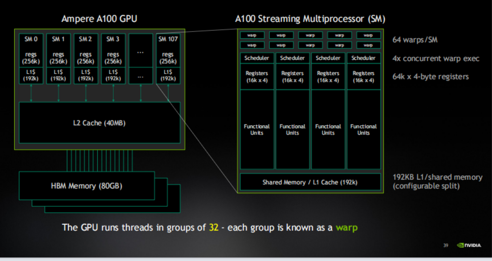

值得注意的是，在SM中，线程是以32个为一组，称之为warp。warp是GPU线程调度的基本单元。对于A100而言，一个SM中也就拥有2048/32=64个warp。

然而，虽然对于A100来说，每个SM中有64个warp。但是，只有四个warp可以同时被执行！也就是说，SM拥有2048个thread，但是实际运行时，只有4*32=128个thread可以被active运行，其余的1920个线程都处于等待被切换的状态如下图所示。这就是之前所说的designd for over subscription，即GPU的thread数量总是超量的，相对于可以被激活执行的最大数量来说。

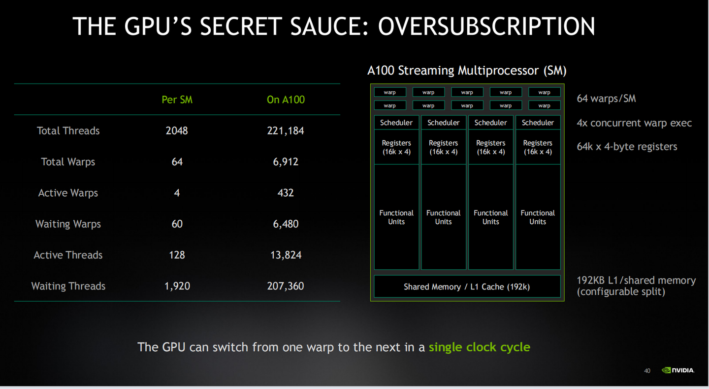

这样做的好处是当GPU的SM中active激活的thread因访问内存而处于等待堵塞时，GPU可以**仅通过一个时钟周期**进行线程的context上下文切换。通过不断地thread切换，使得我们的内存bus总处于忙碌状态，以掩盖Latency带来的影响。这与CPU的状况是完全相反的，CPU的上下文切换开销非常昂贵，所以CPU不希望进行频繁的context切换，只希望通过优化Latency来使得thread里的工作尽快被完成。所以，GPU是throughput machine，以throughput 吞吐量为优化目标设计的机器。cpu则是以Latency为优化目标的Latency Machine。

## 六、挑战Compute Intensity

到了这里，我们需要做一个简单的总结。首先，我们知道了，由于Compute Intensity的存在， Flops并不重要，即计算单元能够计算的数据量往往远超过内存所能传输的数据量。我们实际上应该关心的是我们的数据在哪里？即两个概念：Memory bandwidth内存带宽和Memory Latency内存延迟。对于实际使用场景来说，Latency更加重要，因为Latency的限制会使得我们的Memory bandwidth的利用率低下。为了解决Latency带来的消极影响，GPU采用了超量的线程设计designd for over subscription来掩盖Latency问题。

所以现在，我们解决了Latency，使得内存可以开始忙碌起来了。那么问题就又回到了Compute Intensity的问题，而Compute Intensity问题是与应用场景所采用的算法关联的。接下来我们就来一起看一看不太类型的算法下，GPU的工作情况是如何的。

首先我们来看一看最经典的卷积网络处理图像的案例是如何运行在GPU上的：

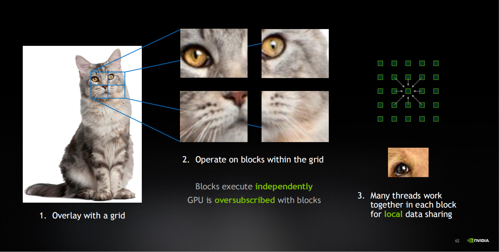

对这样一张图片作为数据来说，我们会将其划分为多个网格块grid，其中每个块作为任务，都可以独立的计算而不需要其他块的信息。这里网格块数量应该远大于GPU中一次性最大能够处理的块，对应了我们前面所说的designd for over subscription。

每一个块作为独立的任务，可以被多个线程同时共享数据来进行计算。如下图所示，一张完整的图片假设对应为第一行的工作量，其会被分成很多块来在GPU的warp上独立运行。

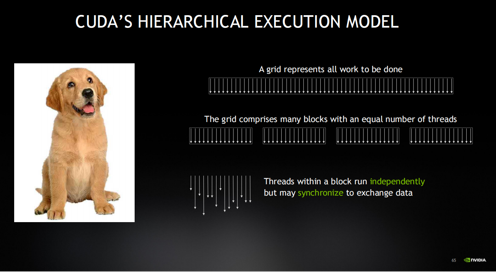

对于上面的工作流程，我们可以知道，GPU是通过将**原始任务的数据**分解为小块后独立进行工作的。接下来我们看一看不同类型的算法中，数据量与计算量的关系。

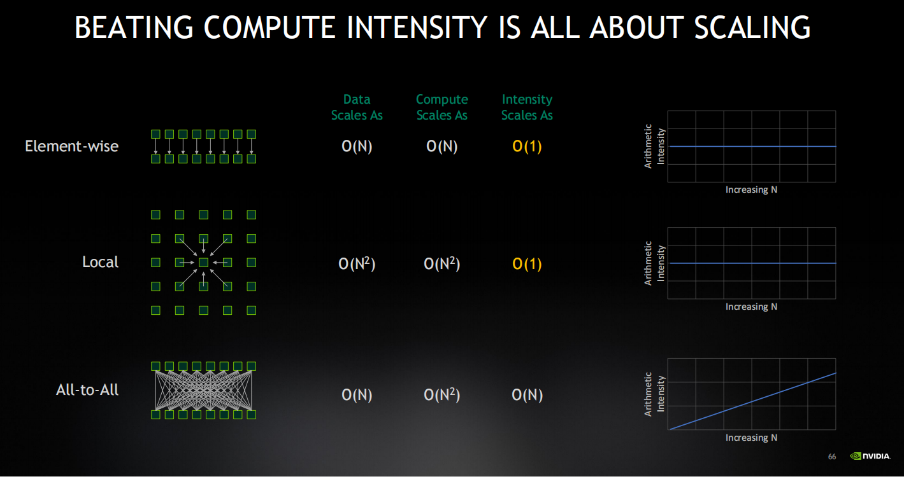

对于第一种Element-wise元素一对一的算法来说。随着其输入数据维度N的线性增长。其所需要的计算量也以O(N)的倍率增长。这也就意味着无论我增加再多的warp去加速计算，其所需要的**计算量与数据量的比值为常数**，也就是说我们永远无法突破Compute Intensity。即无法通过增大数据量来使得我们的GPU计算单元忙碌起来。

而对于我们所熟悉的卷积运算（Local）来说，同样如此：随着我们图片维度大小N的增加，所需要读取的数据量随着O(N2)进行增长，而对于的计算量同样以O(N2)增长。其计算量与数据量的比值仍然为常数。

而对于All-to-All类型的运算来说，我们可以看到，所有数据开始交互，随着输入数据维度N的增长，其所需要的计算量以O(N2)进行增长，计算量与数据量的比值为N。对于这样类型的算法来说，随着我们输入数据维度N的增加，计算量与数据量的比值为N，不再为常数！如此依赖，只要不断增大输入的数据维度，就一定能满足Compute Intensity！

而最典型的All-to-All类型算法，就是我们所熟知的矩阵运算：

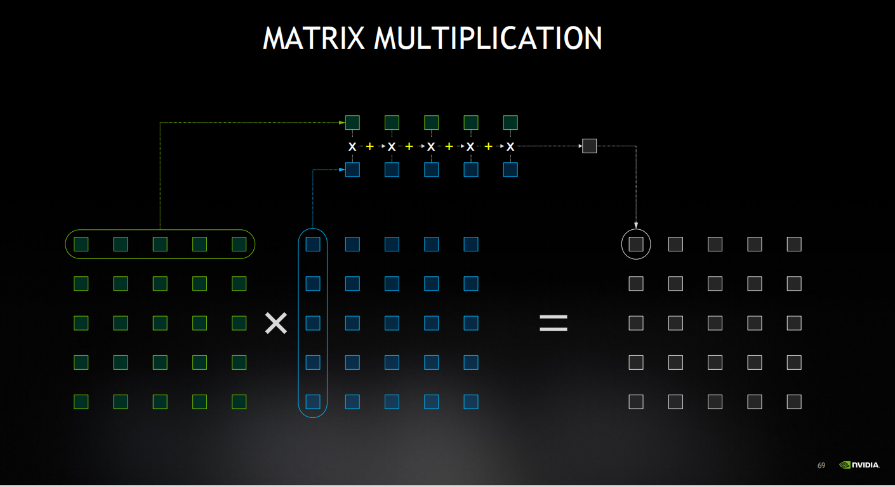

所以说，对于矩阵运算这样的场景，随着我们矩阵的维度的不断增加，Compute Intensity就一定会得到满足。

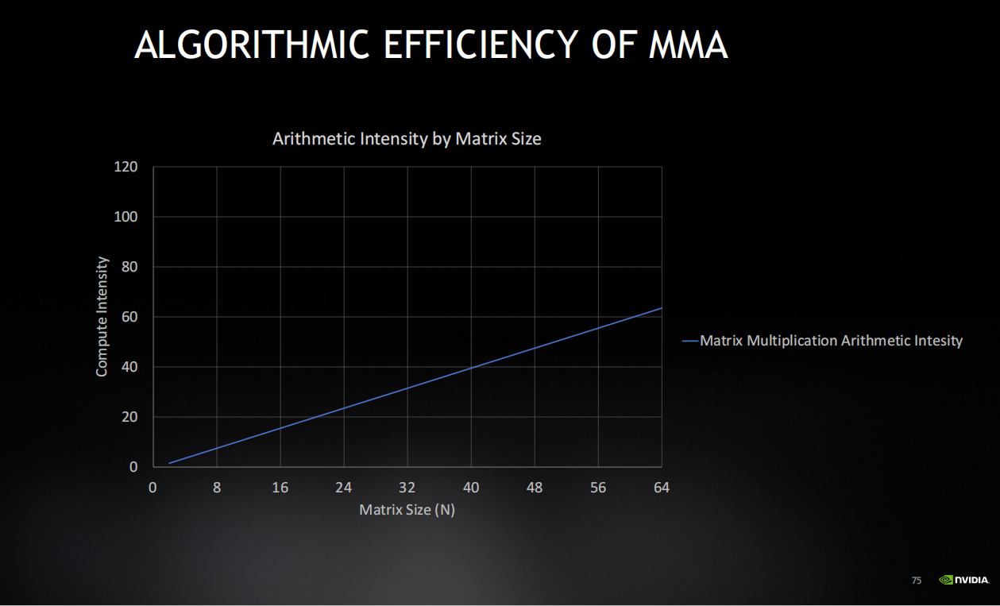

例如对于A100GPU的FP32数据类型来说，其Compute Intensity大约为50，也么也就是说当我们输入的矩阵长度为50左右时，系统达到了最佳的平衡点：即内存与计算core都处于忙碌状态，实现了系统throughput 吞吐量最大化。一旦矩阵小于50，那么计算core就会开始空闲；而一旦矩阵维度大于50，呢么计算core将成为瓶颈，使得内存总线开始空闲。

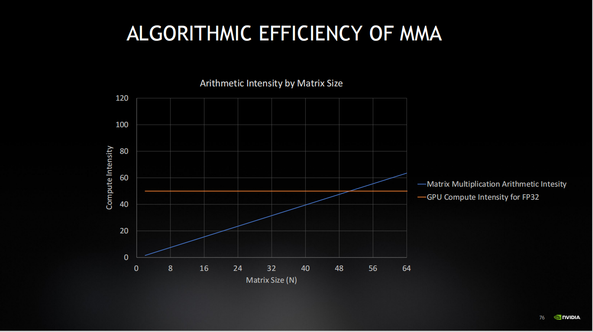

这时你可能会想，这个条件也太苛刻了，谁能保证运算的算法矩阵总是保持50的长度？这时你需要回想我们最开始是如何介绍compute instensity的：compute instensity是计算能力Flop和内存传输速度的比值。也就是说，对于GPU的不同内存层次Memory Hierarchy来说，其compute instensity也就不同。那么如上图所示的最佳平衡点也就不同！

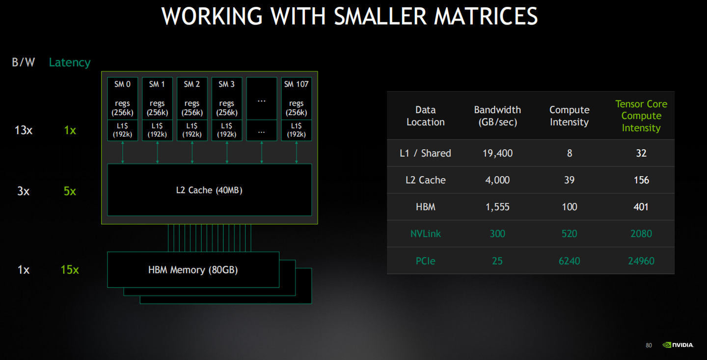

我们可以看到，对于L1 Cache而言，其最佳工作平衡点所需的矩阵维度大概在30左右。也就是说，我们的矩阵离计算core越近，其达到平衡点所需的维度就越小。

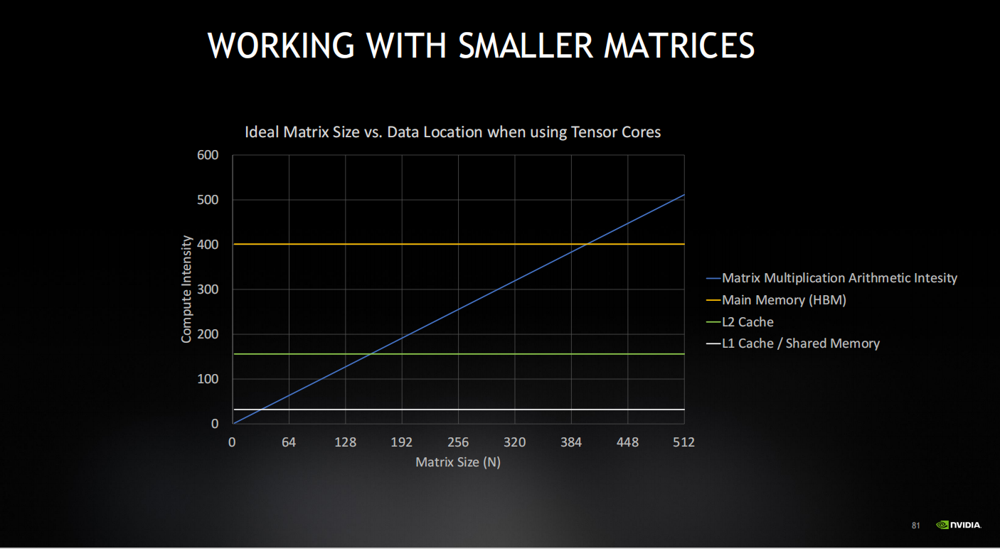

所以，一切的一切都回到了最开始那个问题：where are my data。即一切的前提是搞清楚数据在哪里，数据所处的内存层次不同，其所面临的情况也就截然不同。