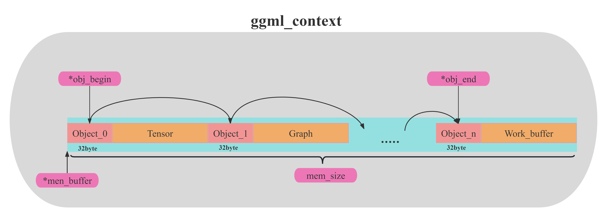

# GGML Guide 学习指南

## 一、核心概念

### 1. buffer

如果在接触ggml之前没有接触过类似的项目时，最令人困惑的概念之一便是buffer。这个概念翻译为中文后总感觉不对味。故此在这里对buffer概念作出解释：

在ggml框架中，一切数据（context、dataset、tensor、weight...）都应该被存放在buffer中。而之所以要用buffer进行集成，承载不同数据，是为了便于实现多种后端（CPU、GPU）设备内存的统一管理。也就是说，buffer是实现不同类型数据在多种类型后端上进行**统一的接口对象**。如下图所示。

***注意！buffer本身并不存储数据，其只是一个数据访问与数据操作的接口。并且buffer里的context指针与下文中的ggml_context不是一回事***

具体的buffer实现于ggml-backend-imp.h文件,详解注释：[Link](./GGML_man/ggml-backend-impl.md#1-ggml_backend_buffer)

### 2. ggml_context

ggml_contex，又是一个翻译为中文后令人困惑的概念，我一直觉得“上下文”这个翻译无法体现该词的真实含义。接下来让我们看看ggm_context在ggml中的作用：

用一句话来说，ggml_context是在ggml中是一个用于管理计算时使用的容器的对象（结构体）。容器里可以承载的数据有三种类型：Tensor、Graph、Work_buffer。并且使用ggml_object结构体将容器内的数据连接，实现链表。内部结构如下图所示：

***注意！在ggml_context中object链表节点后面所存储的Tensor、Graph等并不是数据本身，而是对应数据的信息与索引。例如可以通过Tensor的信息表得知tensor的类型，和其真实数据地址还有对应buffer接口的地址。***

在容器中几个比较重要的成员如下：

- mem_size：ggml_context所维护的容器长度（注意不是ggml_context的长度）
- mem_buffer: ggml_contexts所维护的容器首地址。（之前说过，ggml中一切数据都要放在buffer里，所以这里context维护的容器也需要放在buffer里）
- n_object: 容器内的数据对象的个数
- object_begin:容器内第一个数据链表节点
- object_end:容器内最后一个数据链表节点

具体实现与注释：[Link](./GGML_man/ggml_c.md#1-ggml_contex)

### 3. Tensor

对于ggml的tensor张量部分，与现在主流框架pytroch等概念相似。

值的注意的是tensor中的buffer指向的是能够操作该张量对应的数据块的接口！而实际张量对应的数据地址为“data”指针指向的位置。

具体实现与注释：[Link](./GGML_man/ggml_c.md#2-ggml_tensor)

### 4. Graph

TBD。。。

### 5. Work_buffer

TBD。。。。

