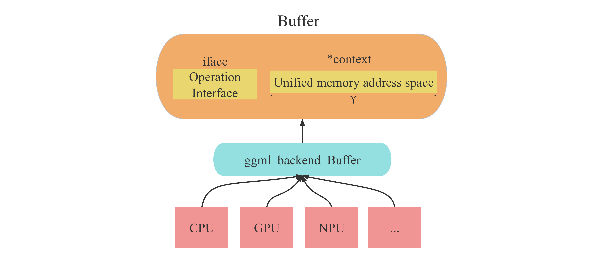
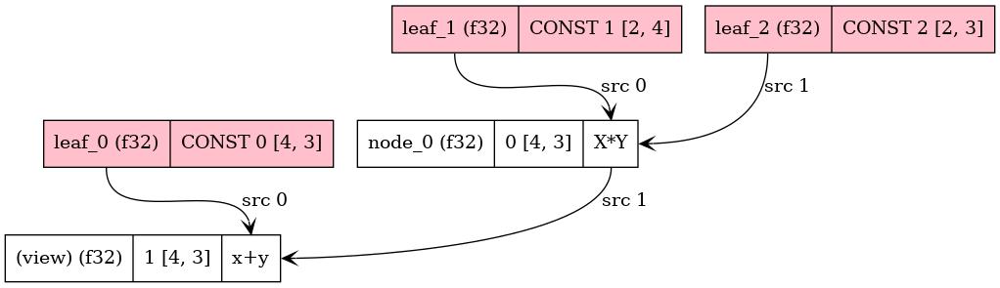
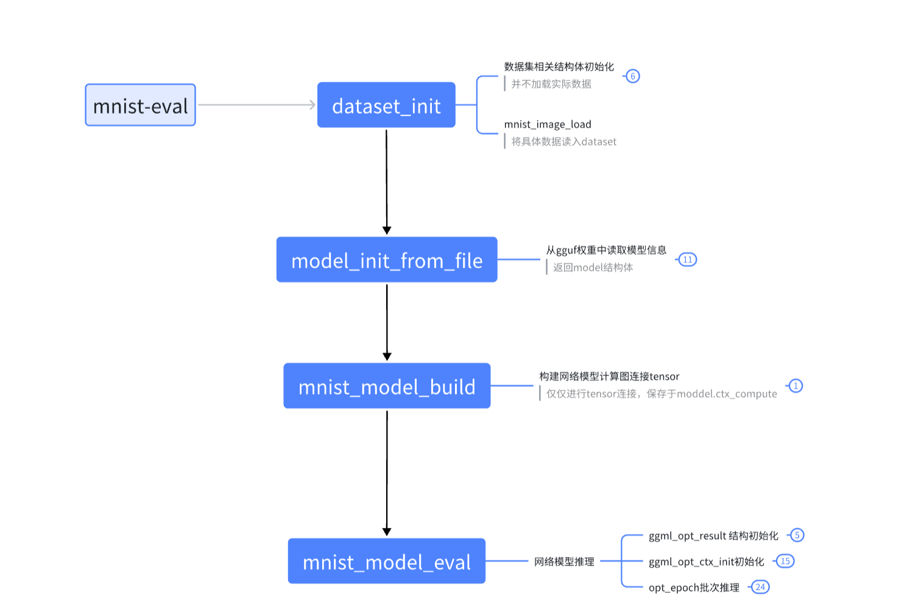

# GGML Guide 学习指南

github项目源码仓库连接： [Link](https://github.com/ggerganov/ggml)

## 一、 Introduction

 ggml是一个用 C 和 C++ 编写、专注于 Transformer 架构模型推理的机器学习库。该项目完全开源，处于活跃的开发阶段，开发社区也在不断壮大。ggml 和 PyTorch、TensorFlow 等机器学习库比较相似，但由于目前处于开发的早期阶段，一些底层设计仍在不断改进中。

相比于其它库，ggml 有以下优势:

- 最小化实现: 核心库独立，仅包含 5 个文件。如果你想加入 GPU 支持，你可以自行加入相关实现，这不是必选的。

- 编译简单: 你不需要花哨的编译工具，如果不需要 GPU，单纯 GGC 或 Clang 就可以完成编译。

- 轻量化: 编译好的二进制文件还不到 1MB，和 PyTorch (需要几百 MB) 对比实在是够小了。

- 兼容性好: 支持各类硬件，包括 x86_64、ARM、Apple Silicon、CUDA 等等。

- 支持张量的量化: 张量可以被量化，以此节省内存，有些时候甚至还提升了性能。
- 内存使用高效到了极致: 存储张量和执行计算的开销是最小化的。

在Hugging face上，Georgi Gerganov本人也发布了一篇介绍GGML的帖子。该篇帖子有英文和中文两个版本，里面介绍了GGML的基础术语和概念，并且有简单的源码demo进行分析。

从这篇介绍贴中你能学到什么？ 

1. ggml简单demo的编译与运行
2. ggml基础术语和概念
3. 运行基础的张量tensor乘法的流程
  
原帖连接：[Introduction to GGML](https://huggingface.co/blog/introduction-to-ggml).

## 二、理解网络推理完整流程

在阅读了上述“Introduction to GGML”文章后，你会对GGML库中的一些术语和基本概念有所了解。

但是遗憾的是，该文章以及示例的simple-demo只是为了展示一些核心概念，并且对于很多概念的细节并为提及。这可能会导致一些之前未接触过相关领域的初学者看完之后仍然不理解一些概念为什么这样设计。并且demo中的很多函数使用的流程与实际推理神经网络推理/训练的过程有所差异（为了使样例简化）。

所以接下来我会使用代码注释与相关图例来帮助你理解一些核心概念，我将对源仓库中examples/simple/simple-backend 的demo源码进行一定的修改，使得其调用过程更接近实际项目中网络推理的过程。

在接下来的demo演示与介绍中主要包含以下内容：

1. **关于ggml核心概念的图解演示**
2. **更接近原项目中example/mnist手写数字识别的计算流程。** 
3. **一个以ggml作为第三方库的代码模板**
4. **一个常用的矩阵优化测试代码sgemm**

这里对第3条做一个简单的解释：在原项目中，我们只能在/examples文件夹下进行新建demo，而无法直接将其作为第三方库插入到我们自己的代码。如果想要将ggml作为库函数，需要进行一些cmake配置。所以我将新建一个空白的demo演示仓库，其中演示的代码将ggml以第三方库的形式调用，方便大家后续想在其他C++工程中使用ggml时进行cmake的配置。

示例源码仓库：[Link](https://github.com/Yangxiaoz/GGML-Tutorial)

### 1.样例介绍--sgemm

SGEMM（Single-Precision General Matrix Multiply）是 BLAS（Basic Linear Algebra Subprograms）库中的一个常用函数，执行单精度矩阵乘法。常被当作矩阵优化测试样例。

在本例中实现的样例为：
$$
C = A \times B + C
$$

### 2. 定义 mode模型

首先我们需要根据计算流程创建mode模型对象，对象成员如下：

```cpp
    struct ggml_tensor * A;
    struct ggml_tensor * B;
    struct ggml_tensor * C;
    // the backend to perform the computation (CPU, CUDA, METAL)
    ggml_backend_t backend = NULL;
    // the backend buffer to storage the tensors data of a and b
    ggml_backend_buffer_t buffer;
    // the context to define the tensor information (dimensions, size, memory address)
    struct ggml_context * ctx;
    // the compute graph (which is piont to a static variable of func, so no need to free )
    struct ggml_cgraph * gf;
```

可以看到，模型对象中有计算所需的tensor、计算的后端backend、还有后端对应的buffer、上下文ctx等等。具体每个成员的细节将会在下文详细介绍。

### 3. ggml_tensor介绍

对于ggml的tensor张量部分，与现在主流框架pytroch等概念相似。其中
tensor结构体中有几个变量值得注意：

```cpp
int64_t ne[GGML_MAX_DIMS]; // tensor 的维度
size_t  nb[GGML_MAX_DIMS]; // tensor不同维度元素实际存储地址的间距步长：stride in bytes:
                                   // nb[0] = ggml_type_size(type)
                                   // nb[1] = nb[0]   * (ne[0] / ggml_blck_size(type)) + padding
                                   // nb[i] = nb[i-1] * ne[i-1]
        // 该tensor是否为算子结果（如add、mul_mat...）
        enum ggml_op op;
        //如果该tensor是某个算子的结果，那么计算时所需的源数据
        struct ggml_tensor * src[GGML_MAX_SRC];
        // 若该tensor是其他tensor的引用（即只是名字不同，实际上指向同一块数据）时
        //引用的目标tensor指针为view_src：
        struct ggml_tensor * view_src;
        size_t               view_offs;
        //tensor实际存储数据的地址指针
        void * data;
        //tensor名字
        char name[GGML_MAX_NAME];
```

值的注意的是tensor中的buffer指向的是能够操作该张量对应的数据块的接口！而实际tensor对应的数据存储的地址为“data”指针指向的位置。

所以，tensor结构体内本身是没有存储任何真实数据的！（即无论tensor数据有多大，ggml_tensor结构体自身占用的空间是固定的）

### 4. buffer介绍

如果在接触ggml之前没有接触过类似的项目时，最令人困惑的概念之一便是buffer。这个概念翻译为中文后总感觉不对味。故此在这里对buffer概念作出解释：

在ggml框架中，一切数据（context、dataset、tensor、weight...）都应该被存放在buffer中。而之所以要用buffer进行集成，承载不同数据，是为了便于实现多种后端（CPU、GPU）设备内存的统一管理。也就是说，buffer是实现不同类型数据在多种类型后端上进行**统一的接口对象**。如下图所示。

***注意！buffer本身并不存储数据，其只是一个数据访问与数据操作的接口。***



具体的buffer实现于ggml-backend-imp.h文件,：[代码详解注释](./GGML_man/ggml-backend-impl.md#1-ggml_backend_buffer)

### 5. cotext介绍

context，又是一个翻译为中文后令人困惑的概念，我一直觉得“上下文”这个翻译无法体现该词的真实含义。而在ggml中，会出现各种context为名称的不同变量。我认为在此框架中，context应该翻译为：“环境信息”。可以类比操作系统的“环境变量”：针对不同的程序，你可能需要不同的环境变量来启动运行程序。

对于ggml框架来说，无论你要做什么（建立modle模型、建立计算图、还是创建承载计算结果的result）都需要先创建一个context作为容器，而你所创建的任何信息结构体（tensor、graph..）实际都存储在context容器包含的地址空间内。

#### 让我们以ggml_context为例


ggml_context是一个用于管理ggml框架推理时使用的各种高级对象信息的容器。容器里可以承载的数据有三种类型：Tensor、Graph、Work_buffer。并且使用ggml_object结构体将容器内的数据连接，实现链表。内部结构如下图所示：


在容器中几个比较重要的成员如下：

- mem_size：ggml_context所维护的容器长度（注意不是ggml_context的长度）
- mem_buffer: ggml_contexts所维护的容器首地址。（之前说过，ggml中一切数据都要放在buffer里，所以这里context维护的容器也需要放在buffer里）
- n_object: 容器内的数据对象的个数
- object_begin:容器内第一个数据链表节点
- object_end:容器内最后一个数据链表节点

Note：
**第二次重复！你需要牢记，ggml_context容器所承载的无论是tensor还是graph，都不是实际的数据本身，而是用来描述他们的结构体对象。实际的数据可以通过这些描述对象为索引，进行访问**

### 6. backend介绍

GGML的后端backend有如下几个比较重要的概念：
① ggml_backend ：执行计算图的接口，有很多种类型: CPU (默认) 、CUDA、Metal (Apple Silicon) 、Vulkan 等等

② ggml_backend_buffer：表示通过应后端backend通过分配的内存空间。需要注意的是，一个缓存可以存储多个张量数据。

③ ggml_backend_sched：一个调度器，使得多种后端可以并发使用，在处理大模型或多 GPU 推理时，实现跨硬件平台地分配计算任务 (如 CPU 加 GPU 混合计算)。该调度器还能自动将 GPU 不支持的算子转移到 CPU 上，来确保最优的资源利用和兼容性。（但是在本次代码中并未使用）

这里，具体的后端细节与后端调度器内容过多，不再追述。后续可能但开一期进行讲解。

### 7. cgraph计算图介绍

我们知道，现在的绝大部分神经网络都可以看作一个有向无环的“计算图”。而后续实际的计算，则是通过遍历该图上的节点来进行推理的。

在本次样例中，根据tensor之间关系构建的计算图如下：



在图中，分为两种类型的元素： node（白）和leaf（红）。一切即不是参数（weight）也不是操作数（即tensor结构体中的op为None）的元素称之为leaf，其余都作为node。

这里可以看到，图中最后一个节点node有（view标识），结合之前对tensor的讲解我们可以知道，这个节点是一个对原节点（C矩阵tensor）的引用。即将结果（AB +C）直接存储在C矩阵tensor中，而不是重新建立一个新的tensor来进行存储。

### 8. gallocr图内存分配器

我们需要明确，图graph是根据我们ctx中的tensor之间关系进行建立的。而graph中可能包含着输入数据、权重、新建的node节点。而这些都只是数据的描述信息，并不是数据本身。所以我们需要有一个专用的内存分配器来对我们计算图graph中所需要使用的全部数据进行内存分配。

而有的数据（例如参数）可能在load_mode加载模型时就已经分配好了对应后端的内存buffer，但我们无需担心，gallocr会确认对应tensor是否以及被分配了buffer,如果已经有了，则会直接跳过。


以上便是我们所设计的 simple_model对象的成员详解。如果你对这些概念有了清晰的认识，那么在看后续代码则会感觉非常轻松。

而关于simple_model对象，还有对应的构造函数和析构函数，具体细节可以自行查阅代码，这里不做过多赘述。

### 9. main函数流程简述

1. 初始化模型model
2. 加载model中的数据tensor、权重（本例中没有）。
3. 构建计算图graph
4. 为计算图graph中所有节点分配对应后端内存
5. 执行计算

实际代码如下：

```cpp
//构造simple_model结构体并加载矩阵A、B、C数据
simple_model model = load_model(matrix_A, matrix_B, matrix_C, sgemm_M, sgemm_K, sgemm_N, backend);

// 建立计算图graph并分配对应后端backend内存
ggml_gallocr_t allocr = NULL;
{
    //初始化图分配器gallocr
    allocr = ggml_gallocr_new(ggml_backend_get_default_buffer_type(model.backend));

    // Build graphs based on tensor relationships
    model.gf = build_graph(model);
    //根据gf图计算所需空间，进行内存空间预留
    ggml_gallocr_reserve(allocr, model.gf);
    }
// 执行计算
struct ggml_tensor * result = compute(model, allocr);
```

---

在这个demo中，大致演示了一个相对完整的计算过程。但实际的神经网络推理过程还有模型权重加载、后端调度期backend_shcedul相关等流程。

到了这里，再回过头看llama.cpp的源码代码，就会轻松很多。但如果你仍然觉得llama.cpp的源码不好理解，或者你想了解如何使用ggml进行网络训练和推理。可以学习ggml项目中/example/mnist手写数字识别demo：[Link](https://github.com/ggerganov/ggml/tree/master/examples/mnist)

本人也对这个mnist手写数字识别的demo进行了详细的学习，并且总结了该demo的整体框架思维导图：


详细的导图细节与如何遍历计算图等内容见链接：[Link](https://n02lxruxa4.feishu.cn/wiki/HPGjwT7FAiyZttkNCErcl7lXnKg?from=from_copylink)

