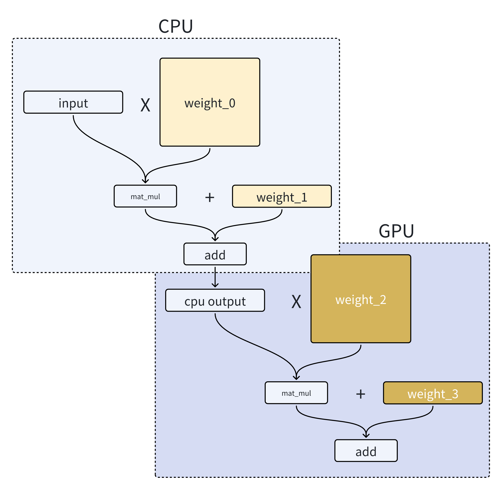
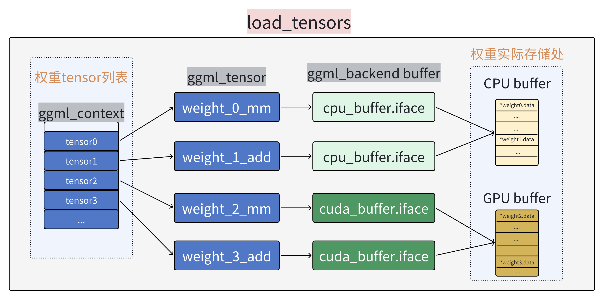
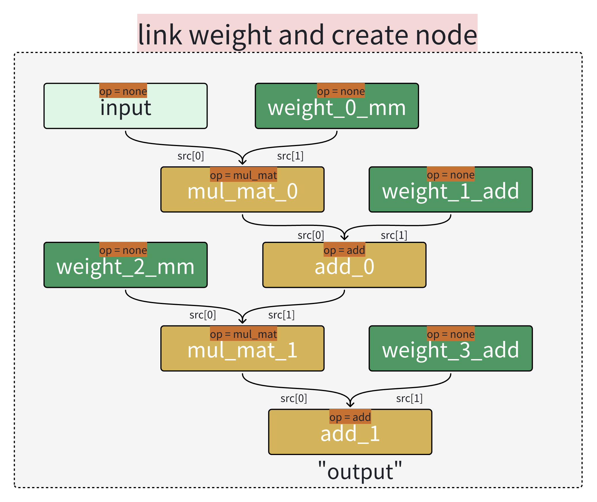
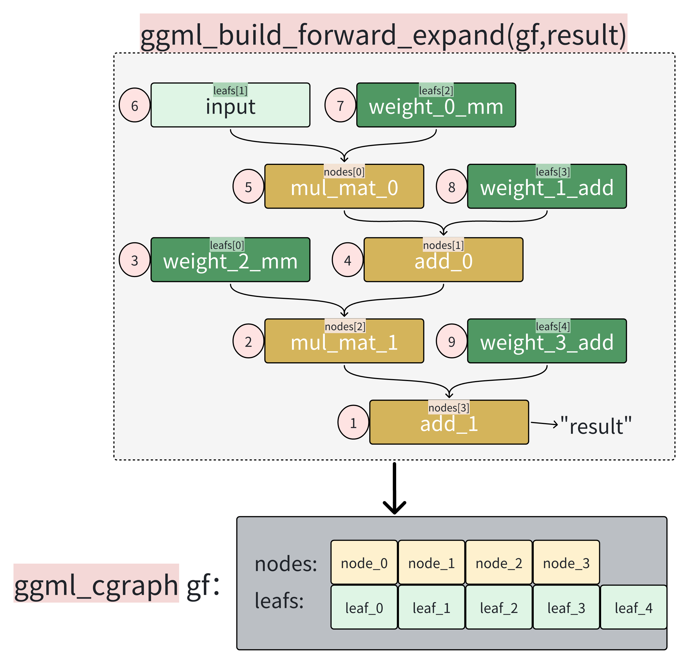
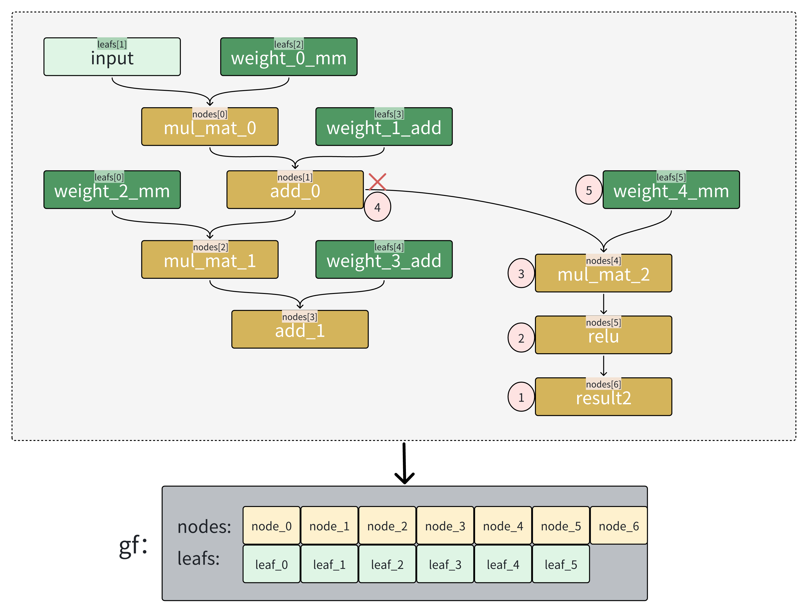
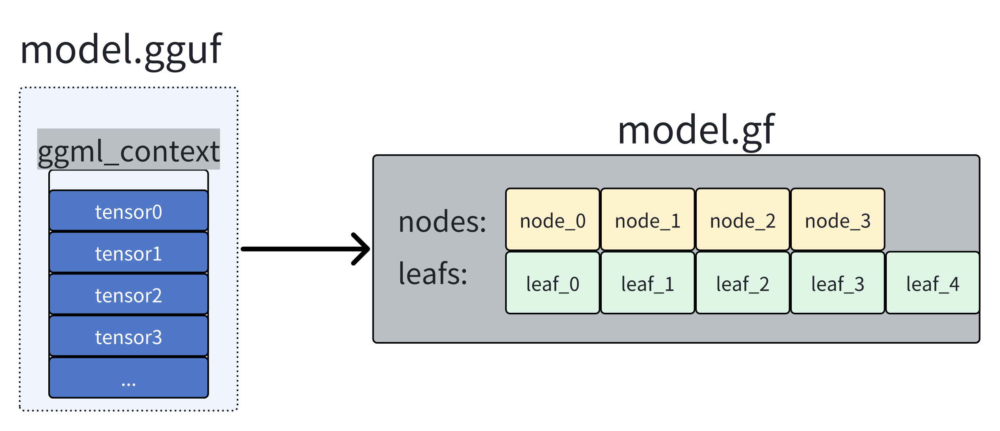

# llama.cpp源码解读--cgraph计算图与sched后端调度机制详解

本文将会介绍llama.cpp推理过程中使用的一些机制细节，主要包括了：
1. 如何将从.gguf文件中读取到的权重tensor连接，构建cgraph计算图
2. 如何根据多后端backend场景或用户需求对计算图进行子图分割split
3. 如何通过sched调度器对分割子图进行计算、多后端调度

在阅读本文之前，你需要先阅读 ：[ggml基础概念](./GGML_Guide.md)和[llama.cpp总体流程简介](./Llamacpp0.md)。

*本文介绍的机制仍然属于ggml框架的范畴，针对llama.cpp在llm推理时使用到的更“高级”的机制概念（如 kv cache的管理、多batch管理、 Pipeline Parallel、 Tensor Parallel等 ）不在本次文章的探讨范围。*


## 一、例程说明

为了更好的理解上述机制，本文将使用llama.cpp的推理流程范式对一个自定义的简单矩阵乘法、加法例程进行演示并解释说明，并且使用CPU+GPU两种后端进行混合推理。（之所以不直接对llama.cpp下的examples/simple例程进行讲解分析的原因是，现在的llm中权重数量过多，随便一个模型在构建graph之后就能达到上千个node。所以对着上千个node进行逐行debug调试理解显然会造成一定的麻烦）。本次例程过程描述如下：



可以看到，在整个过程中，我们将有4个权重weight参数，并利用这4个weight对一个输入input向量进行两次的矩阵乘法和加法操作。

并且我们希望第一次的矩阵乘法、加法操作在CPU上进行，而第二次的操作在GPU上进行，最终实现多后端backend的混合推理流程。

## 二、流程解析

### 1.load_tensor 读取模型权重

在llama.cpp进行推理时，除了注册、加载后端设备之外，首先要做的就是从.gguf文件中读取模型信息和模型权重参数。具体如何提取.gguf文件中的模型信息等读者可以自行查看源码。在这里只需要知道，在加载完毕.gguf文件之后，我们得到了一个 **llama_model * model** ; 对象，而该对象中的layers向量成员中，保存了每一层的权重weight tensor列表
```cpp
struct llama_model {
    ...
std::vector<llama_layer> layers;
    ...
}
```
其中llama_layer结构体内容如下：
```cpp

struct llama_layer {
    // normalization
    struct ggml_tensor * attn_norm       = nullptr;
    struct ggml_tensor * attn_norm_b     = nullptr;
    struct ggml_tensor * attn_norm_2     = nullptr;
    ...
    ...
}
```

所以，在加载完毕.gguf文件之后，我们有的只是一系列的weight tensor列表,如下图所示：



(这里对ggml中的概念做一个简单复习：ggml_context是一个容器，其可以容纳ggml中不同类型的各种结构，如：tensor、graph等。  ggml_tensor只是weight的描述对象，其描述了weight的信息和实际weight存放指针*.data、访问接口.iface等。 实际weight存放与不同backend buffer中。还是不理解的可以回看文章：[ggml概念解析](./GGML_Guide.md))

这里我们可以看到，在模型加载权重参数时，llama.cpp就会根据 **model_params.n_gpu_layers = ngl;** 参数来将对应层数layer的参数加载到不同的backend。

实际的ngl指的是模型中offload卸载到GPU的前ngl层。例如一个模型有27层，而当传入参数ngl=10时，llama.cpp就会将模型的前10层权重weight加载到 GPU cuda_buffer,剩余的weight加载到cpu_buffer。

只不过在本次例程中，为了方便，将前两个weight加载至CPU backend，后两个weight加载至GPU backend。

### 2. build_graph：计算图构建

在llama.cpp中，构建计算图graph有两个步骤： 
1. 使用算子函数连接weight参数、创建中间计算节点
2. 使用ggml_build_forward_expand()函数构建计算图

例程代码如下所示：
```cpp
 ggml_tensor * cur;
 // C = mut_mat(A,B) == B(A.T)
 //step 1: link weight and create temp compute node
 cur = ggml_mul_mat(ctx, weight_0_mm, inp);
 ggml_set_name(cur, "mul_mat_0");

 cur = ggml_add(ctx,cur,weight_1_add);
 ggml_set_name(cur, "add_1");

 cur = ggml_mul_mat(ctx, weight_2_mm, cur);
 ggml_set_name(cur, "mul_mat_2");

 cur = ggml_add(ctx,cur,weight_3_add);
 ggml_set_name(cur, "add_3");

 //step 2: build the graph
 ggml_build_forward_expand(gf, cur);
```
- step 1:
  
首先在经过第一个步骤之后，我们将会得到如下tensor连接关系图。注意，此时并没有构造graph之类的结构记录下图所示的拓扑结构关系。tensor之间的连接关系是依靠ggml_tensor结构体中的src指针所记录。

```cpp

    struct ggml_tensor {
        ...
        // compute data
        enum ggml_op op;
        ...
        struct ggml_tensor * src[GGML_MAX_SRC];
        ....
    };
```



我们可以看到,经过我们手动使用ggml_mul_mat、ggml_add之类的算子函数对tensor进行连接后，会产生一些中间节点tensor（上图中黄色的块块）。值得注意的是。这些由算子连接函数产生的中间计算tensor在此时并没有被分配对应的后端backend buffer，这部分tensor的backend buffer将在sched调度器split分割子图时进行动态分配。

- step 2:

在经过step1之后，我们已经将所有的weight以及中间计算tensor通过src指针连接了起来。接下来便是使用ggml_build_forward_expand()进行cgraph计算图的构建了。

而在构建cgraph计算图之前,我们需要先了解一下ggml_cgraph结构体中的成员的含义都是什么，下面是ggml_cgraph的源码实现：

```cpp
struct ggml_cgraph {
    int size;    // maximum number of nodes/leafs/grads/grad_accs
    int n_nodes; // number of nodes currently in use
    int n_leafs; // number of leafs currently in use

    struct ggml_tensor ** nodes;     // tensors with data that can change if the graph is evaluated
    struct ggml_tensor ** grads;     // the outputs of these tensors are the gradients of the nodes
    struct ggml_tensor ** grad_accs; // accumulators for node gradients
    struct ggml_tensor ** leafs;     // tensors with constant data

    struct ggml_hash_set visited_hash_set;

    enum ggml_cgraph_eval_order order;
};
```

*这里我们先忽略**grads**和**grad_accs**这两个成员，因为这两个成员主要是用来做反向传播求梯度时使用的，而本文主要讨论推理过程。*

我们可以看到，对于ggml_cgraph来说，最主要的就是**nodes和leafs**两个由ggml_tensor* 构成的数组，顾名思义其分别代表计算图的节点nodes数组和枝叶leafs数组。“**visited_hash_set**”则是用来记录计算图graph中已经包含的tensor信息，防止在一个计算图中重复添加了多个一样的tensor。“**order**”则是用来记录该graph在建立时，是遵循从左到右的图遍历顺序还是从右到左的图遍历顺序。（在本文以及llama.cpp中，默认使用从左到右的图遍历顺序）

接下来我们来看一看ggml_build_forward_expand(ggml_cgraph *gf,ggml_tensor * result)函数是如何通过tensor之间的关系来进行graph图构建的：

首先对于该函数的传入参数来说，正如该函数的名字所示，该函数用作计算图扩展，所以即使是第一次调用，也需要传入一个空的gf指针，使得该函数在这个空的gf指针上进行graph图扩展。 对于第二个参数result，应该为你上一个步骤连接tensor之后的最后一个tensor。对于本例程来说，该result应该为第二次add加法计算后的结果，也就是“**add_1**” tensor。而ggml_build_forward_expand函数进行图构建的过程如下图所示(该函数在图遍历构建计算图graph时采用了递归的方法进行遍历，所以直接看代码进行理解可能会较为困难，故我将借助下图来解释整个过程)：



接下来我将逐步解释上图的graph构建过程:

首先，带有数字的红色圆圈代表了在构建过程中，对tensor的访问顺序。按照之前所说，我们传入的参数result是之前步骤中的最后一个计算tensor，也就是“**add_1**”,所以当调用“**ggml_build_forward_expand（）**”函数后，第一个访问的tensor便是“**add_1**”。 紧接着，由于我们默认在图遍历时采用从左向右的顺序进行遍历访问，所以第二个递归访问的tensor便是“**add_1**”的左源操作数，也就是src[0]:"**mul_mat_1**"。第三个递归访问“weight_2_mm”权重tensor。

那么，什么时候停止？：当当前访问的tensor的src全部被访问之后（或者src == NULL，也就是没有源操作数时），停止递归访问，进行return返回。不过在return返回之前，需要对当前的tensor进行判断，判断其为node节点还是leaf枝叶节点，并将其push进对应的数组

一般地，当当前tensor 的 “op”== NULL时，也就是当该tensor不需要进行计算时认为它是leaf枝叶节点，其余的需要计算的tensor都认为是node节点。（为什么要说“一般地”呢？因为当你需要反向传播时，即便是 op ==NULL 的权重tensor，也需要参与计算“反向传播” ，所以当你需要反向传播是，你需要手动标记当前tensor->flags为“GGML_TENSOR_FLAG_PARAM”，此时除了input和output之外的所有tensor，都会被当作node节点）

所以，当我们访问到第三个tensor，也就是“**weight_2_mm**”时，会因为没有src源操作数可以访问而结束当前分支的递归，并且由于该tensor属于leafs，将其压入gf.leafs数组，此时，我们的gf中的第一个枝叶leasf[0]就成功诞生了。

在“**weight_2_mm**”tensor返回后，继续递归访问“**mul_mat_1**”的右源操作数，也就是mul_mat_1->src[1]。此时，我们便访问到了第四个tensor“add_0”。

由于我们的神经网络都可以看作有向无环图，所以按照这样的方法一定能够遍历所有tensor。并且由于“递归return时添加node节点的特性”，使得对于我们的 **nodes** 数组来说，id索引号大的tensor在计算时，一定只会依赖于id号比它小的tensor。所以我们在后续的图遍历计算时，只需要按照数组id索引，**从0到n依次进行线性遍历，就能完成对整个计算图的计算。** 所以与其称gf为计算图，我认为不如称其为“**节点数组**”更为贴切。

- 多次调用ggml_build_forward_expand():

在llama.cpp对于实际的网络进行图构建时，往往不会一次性将所有权重weight进行link连接之后，使用一次ggml_build_forward_expand()对完整的graph图进行构建。而是每次link连接一小部分，然后不断使用ggml_build_forward_expand函数对graph进行扩展。例如当你想给你的网络添加一个分支，你不必修改之前的代码，只需要对新的结果result_tensor调用一次ggml_build_forward_expand()即可实现计算图graph的扩充，如下所示：



可以看到，当递归遍历到第四个tensor时，由于该tensor在之前已经被访问（加入graph），所以会立即return，终止递归。这一快速检查是否被访问的功能便是通过之前所说的cgraph结构体中的“**struct ggml_hash_set visited_hash_set;**”哈希表映射来实现的。

### build_graph小结：

至此，我们完成了llama.cpp中将模型model信息从.gguf权重文件到cgraph计算图转化的过程，如下所示：



所以现在，我们只需要对这个线性数组gf进行一系列的规划、并线性遍历计算，就可以完成一次网络的推理。但此时你需要清楚，这个线性数组gf中的nodes[]数组中的节点都没有被分配对应的backend后端以及backend buffer，因为他们是在link连接时产生的tensor。而不像weight_tensor是在model加载时，就已经确定其对应的backend、buffer了。

对于nodes[]计算节点来说，当输入batch变化、输入序列长度等变化时，这些计算节点所需要的内存等计算资源会动态发生变化。并且当你拥有多个backend后端设备时，你需要调度这些异构的计算设备来处理这个线性nodes[]节点队列，使得其能最大化“并发”。所以，为了能够动态、合理地分配nodes[]数组中tensor所占用的各种资源，便需要借助**ggml_backend_sched**调度器来实现。

那么，接下来让我们一起了解一下与**ggml_backend_sched**调度器相关的机制和概念吧！


### ggml_backend_sched对象浅析：

首先，我们可以来看一看**ggml_backend_sched**对象中，都有哪些成员：

```cpp
struct ggml_backend_sched {
    bool is_reset;            // 是否被重制
    bool is_alloc;            //  是否进行了图分配内存

    int n_backends;                                              //运行时，可用的后端数
    ggml_backend_t backends[GGML_SCHED_MAX_BACKENDS];            //后端列表
    ggml_backend_buffer_type_t bufts[GGML_SCHED_MAX_BACKENDS];   //后端buffer列表
    ggml_gallocr_t galloc;                                       //图内存分配器

    // 映射graph中的节点的哈希表
    struct ggml_hash_set  hash_set;
    int                 * hv_tensor_backend_ids; // [hash_set.size]
    struct ggml_tensor ** hv_tensor_copies;      // [hash_set.size][n_backends][n_copies]

    // 节点对应backend索引
    int * node_backend_ids; // [graph_size]
    int * leaf_backend_ids; // [graph_size]
    //上一次运行索引记录
    int * prev_node_backend_ids; // [graph_size]
    int * prev_leaf_backend_ids; // [graph_size]

    //cgraph以及split子图分割相关
    // copy of the graph with modified inputs
    struct ggml_cgraph graph;
    // graph splits
    struct ggml_backend_sched_split * splits;
    int n_splits;
    int splits_capacity;

    // 用于支持流水pipline并行相关副本id索引
    int n_copies;
    int cur_copy;

    //记录子图执行的事件
    ggml_backend_event_t events[GGML_SCHED_MAX_BACKENDS][GGML_SCHED_MAX_COPIES];
    //总graph输入
    struct ggml_tensor * graph_inputs[GGML_SCHED_MAX_SPLIT_INPUTS];
    int n_graph_inputs;
    struct ggml_context * ctx;

    //用户自定义函数接口
    ggml_backend_sched_eval_callback callback_eval;
    void * callback_eval_user_data;

    char * context_buffer;
    size_t context_buffer_size;

    int debug;
};
```
这里大家大致浏览一遍有个印象即可，具体每个成员变量是用来做什么的，会在后续结合例程来解释。

但是有两个成员需要在这里做一个说明，那就是用户自定义接口：

```cpp
//用户自定义函数接口
ggml_backend_sched_eval_callback callback_eval;
void * callback_eval_user_data;
```

这个函数是作者为开发者用户预留的接口，用于在后续计算graph时观察任何你想要观察的tensor状态、数值。比方说，如果你现在设计了一个新的Attention算子，并将其整合到了一个llm当中，现在你想要观察每一层中attention算子输出的结果是什么样的。这时你便可以使用该接口，来进行观察。

其中， **callback_eval_user_data()**函数的内部逻辑由用户自己定义。当其被定义，即**sched.callback_eval**指针不为null时，ggml在每次执行一个graph的node之前，都会调用该 **callback_eval_user_data**函数来询问是否需要观察该node节点。当该函数返回true时，表面用户想要访问该node节点。则会在执行完毕该节点之后，再次调用该函数，来让用户提取该node节点中的信息。具体更细节的问题读者可以自行查阅源码，这里不做过多的赘述了。

在这里，我们需要明确，此时我们有的只是一个cgraph计算图，并且该计算图中的很多节点还没有被分配内存。所以为了能够进行最终的compute计算，我们还需要将cgraph进行内存、后端的绑定以及子图的分割（因为我们想让graph图中前半部分在CPU中执行，后半部分在GPU中执行，显然需要将先前的完整graph图分割为CPU子图和GPU子图）


而 **ggml_backend_sched_alloc_graph()** 函数便是用来解决上述问题的。该函数内部有两个函数：1.split子图分割函数 2. split子图backend分配函数。如下所示：

```cpp
bool ggml_backend_sched_alloc_graph(ggml_backend_sched_t sched, struct ggml_cgraph * graph) {
    GGML_ASSERT((int)sched->hash_set.size >= graph->n_nodes + graph->n_leafs);
    //子图分割
    ggml_backend_sched_split_graph(sched, graph);
    //分割后的子图alloc
    if (!ggml_backend_sched_alloc_splits(sched)) {
        return false;
    }
    sched->is_alloc = true;
    return true;
}
```

我们首先介绍 ggml_backend_sched_split_graph()子图分割函数：

### split子图分割

在这一步骤中，该函数干了两件事： 1. 将graph中的每个tensor（node和leafs）绑定到合适的backend_id  2.根据nodes中绑定的的backend_id后端进行子图分割。

以上两件事在代码中体现为五个step步骤：

1. 根据哈希映射表，获取当前节点（tensor）的backend_id并进行绑定
2. 扩展绑定上一个步骤中，因未分配到合适的backend_id的tensor
3. 检查是否有可以进行backend后端升级的tensor（例如某个tensor既可以在cpu中也可以在gpu中时，便将其升级的gpu中）
4. 根据dst和view_src分配剩余未分配的的src节点（view节点等）
5. 进行子图分割

总体流程如下所示：


   